# CoopNavigationSDS

CoopNavigationSDS is a research framework for the automatic, phase-aware
evaluation of cooperative speech dialogue systems. Two agents solve a public
transport route-finding task:

- **Agent A** represents a caller who knows the start station, destination,
  departure time, valid station and line names, and private travel constraints.
- **Agent B** represents the dialogue system. It proposes grounded routes,
  responds to clarification and critique, and improves proposals as Agent A
  reveals constraints.

The framework is designed for controlled comparisons of language models,
text-to-speech systems, automatic speech recognition systems, personas,
scenarios, and speech conditions. It records raw phase evidence during the
dialogue and calculates all registered metrics retrospectively.

## Project at a glance

**Author: Michail Sendetskiy · Python · speech dialogue evaluation**

A dialogue can sound plausible while proposing an invalid route or forgetting a
traveller's constraint. This thesis research framework makes those failures
inspectable: two agents negotiate a transport route, and the system records how
language generation, speech recognition, dialogue decisions, and route validity
contribute to the outcome.

| Explore | Start here |
| --- | --- |
| The task | [Transport network](#7-transport-network-and-dialogue-task) and [network diagram](docs/network_graph.svg) |
| Engineering | [Pipeline](#5-pipeline), [experiment integrity](#6-experiment-integrity), and [source package](coop_navigation_sds/) |
| Reproducible design | [Agent B experiment guide](jobs/agent_b_llm/README.md) and [batch manifests](jobs/agent_b_llm/batches/) |
| Implementation checks | [Test sources](tests/) and [validation instructions](#19-validation) |
| Outputs | [Result structure](#16-result-structure) and [comparison/reporting guide](#13-batch-comparison-and-visualization) |

After following the [setup instructions](#10-setup), a dependency-light check is:

```bash
python -m coop_navigation_sds --smoke
```

This exercises the pipeline with lightweight deterministic agents. It does not
establish comparative performance of the full language and speech models.

### Reading experiment counts

Experiment sizes belong to a specific manifest and revision. The
[documented design at revision 6bc7f943](https://github.com/generalgroovy/sds/blob/6bc7f943dbe8bece0b68c4f6d8782f00942f4b5c/jobs/agent_b_llm/README.md)
uses six Agent B models:

| Design | Configured conditions |
| --- | ---: |
| One focused model/caller job | 26: 13 audio and 13 matched text controls |
| UserLM-only comparison, six jobs | 156 total |
| Both caller variants, twelve jobs | 312 total |
| Expanded speech-grid comparison, six jobs | 312 total: 52 per job |

These are configured condition counts. Completed runs and measured findings
must be read from the corresponding run manifests and result artifacts. When
citing a different experiment or an earlier design, link its exact manifest
and revision.

## Reader Guide

| Chapter | Purpose |
| --- | --- |
| [1. Research Scope](#1-research-scope) | Thesis questions, boundaries, and intended inference |
| [2. Program Specification](#2-program-specification) | Normative functional, knowledge, lifecycle, and schema contracts |
| [3. Documentation Map](#3-documentation-map) | Authority of README, metric, API, and rebuild documents |
| [4. Engineering Practices](#4-engineering-practices) | DRY, KISS, SOLID, evidence, and prompt-design decisions |
| [5. Pipeline](#5-pipeline) | Chronological speech-dialogue phases and component lanes |
| [6. Experiment Integrity](#6-experiment-integrity) | Isolation, traceability, reproducibility, and failure controls |
| [7. Transport Network and Dialogue Task](#7-transport-network-and-dialogue-task) | Network, routes, constraints, stages, and optimal baselines |
| [8. Components and Frameworks](#8-components-and-frameworks) | Agent, LLM, TTS, ASR, NLU, and dialogue implementations |
| [9. Configuration](#9-configuration) | GUI, saved settings, immutable resolution, and setting reference |
| [10. Setup](#10-setup) | Windows/Linux environments, providers, models, and preflight |
| [11. Single-Run Execution](#11-single-run-execution) | GUI, scripted, and smoke-test runs |
| [12. Job Files and Batch Execution](#12-job-files-and-batch-execution) | Canonical hierarchy, grids, pairing, coverage, and process shards |
| [13. Batch Comparison and Visualization](#13-batch-comparison-and-visualization) | Combined tables, controlled deltas, and HTML reports |
| [14. Data Capture](#14-data-capture) | Turn, phase, timing, memory, task, and audio evidence |
| [15. Metric Overview](#15-metric-overview) | Metric phases, evidence classes, and retrospective calculation |
| [16. Result Structure](#16-result-structure) | Standard artifacts, identities, and analysis tables |
| [17. Console Views](#17-console-views) | Startup, dialogue, and retrospective console output |
| [18. Project Structure](#18-project-structure) | Package responsibilities and generated references |
| [19. Validation](#19-validation) | Test commands, scope, and known limitations |

## 1. Research Scope

The software supports research questions such as:

- Which phase-specific metrics best predict task completion and constraint
  satisfaction across language models of different sizes?
- Where does the earliest measurable failure occur in an unsuccessful speech
  dialogue?
- How do speech synthesis and recognition errors propagate into language
  understanding, dialogue policy, and route selection?
- Which clarification and repair behaviors prevent an acoustic or semantic
  error from becoming a task failure?
- Do larger language models improve grounded route proposals enough to justify
  additional latency and resource use?
- Are metric relationships stable across scenarios, repetitions, model
  families, and paired text/audio conditions?

The experiment is not a generic chatbot benchmark. It measures cooperation in
a bounded task with machine-verifiable routes, progressively revealed
constraints, known optimal baselines, and explicit success criteria.

## 2. Program Specification

This section is the normative software specification. Later sections explain
the network, providers, metrics, commands, and artifacts in greater depth.

### System Boundary

| Item | Specification |
| --- | --- |
| Experimental unit | One complete dialogue condition identified by a stable `condition_id` |
| Compared system | Agent B policy plus its language model, synthesis, recognition, and decoding configuration |
| Controlled caller | Agent A implementation, task persona, audio persona, and private constraint sequence |
| Task | Cooperatively select a valid route from a known start to destination at a known departure time |
| Primary outcomes | Natural task closure, route validity, acceptable duration, and satisfaction of every stated constraint |
| Explanatory evidence | Turn-level text, audio, recognition, normalization, semantic state, memory, policy events, timings, and candidates |
| Analysis time | Final metrics are calculated only after the dialogue from persisted raw evidence |
| Execution modes | Optional configuration GUI, scriptable single run, sequential batch, parallel process shards, and dependency-light smoke test |
| Supported operating systems | Windows and Linux; component availability is checked for the current host before execution |
| Output boundary | One project-level `results/` root; each invocation creates one self-contained run directory |

The GUI is configuration-only. It is not required by the experiment runtime,
does not mediate dialogue turns, and closes before model initialization. A
headless batch therefore follows the same runtime path as an interactive run.

### Functional Requirements

| ID | Requirement | Verification evidence |
| --- | --- | --- |
| FR-01 | Build a connected, seed-reproducible transport network and validate the selected scenario before dialogue starts | Network overview, graph, seed, and preflight report |
| FR-02 | Calculate an optimal route for validity/time and after every progressively active constraint layer | `optimal_routes_by_layer` and route-comparison events |
| FR-03 | Keep Agent A and Agent B knowledge and conversation memory separate | Per-agent memory snapshots and additions |
| FR-04 | Route every production message through natural-language generation, text-to-speech, automatic speech recognition, normalization, understanding, and dialogue management | Ordered phase trace for every turn |
| FR-05 | Make the listener react to recognized and transparently normalized speech, never hidden intended text | Intended, spoken, raw-recognized, corrected, and understood fields |
| FR-06 | Require Agent B proposals to name stations and transport lines and validate them against the authoritative network | Parsed route steps and validation diagnostics |
| FR-07 | Reveal at most one new private Agent A constraint after the current objective has been satisfied | Stage and constraint-revelation events |
| FR-08 | Preserve all previously active constraints while seeking an improved route | Constraint-retention state and candidate evaluations |
| FR-09 | Isolate unclear words with short repair turns and return to the unresolved task stage after repair | Clarification target, correction evidence, and repair outcome |
| FR-10 | Allow only Agent A to close the dialogue; suppress Agent B closure attempts | Closure-suppression event and final stop reason |
| FR-11 | Store raw metric inputs before retrospective computation | `metric_inputs.json` and protocol timestamp ordering |
| FR-12 | Export single and batch runs through compatible long and wide analysis schemas | `metrics_long.*` and `metrics_wide.*` |
| FR-13 | Maintain a results-root matrix of planned and completed experimental combinations | `experiment_coverage_*` tables and report |
| FR-14 | Map every local or Slurm array index to one immutable Agent B condition and collision-safe result folder | exported `condition.json` and `task_summary.json` |

### Non-Functional Requirements

- **Traceability:** every derived value points back to a condition, turn,
  phase, formula, operands, and raw evidence.
- **Reproducibility:** network, audio-persona, model-sampling, and iteration
  seeds are persisted with resolved configuration and environment metadata.
- **No silent substitution:** a failed backend cannot be replaced by another
  backend inside a condition. The condition fails explicitly.
- **Portability:** paths are resolved from the project root and artifact names
  are bounded, ASCII-safe, and portable across Windows and Linux.
- **Extensibility:** dialogue orchestration depends on provider-neutral model,
  synthesis, and recognition interfaces rather than provider-specific code.
- **Retrospective validity:** unavailable metrics are represented as `null`
  with a reason; zero is reserved for a legitimate measured zero.
- **Batch comparability:** factors and identifiers are normalized so outputs
  from independent invocations can be concatenated without schema conversion.

### Actor Knowledge Contract

| Knowledge | Agent A | Agent B |
| --- | --- | --- |
| Valid station and line vocabulary | Yes | Yes |
| Start, destination, and departure time | Known privately at startup | Learned only from heard Agent A speech |
| Private constraints | Known in ordered sequence | Learned only after Agent A states each constraint |
| Network topology and route calculation | No | Yes |
| Precalculated optimal routes | No | Available to runtime verification, not disclosed as hidden dialogue memory |
| Own intended utterances | Yes | Yes |
| Other agent's intended utterances | No | No |
| Other agent's recognized utterances | Only the transcript delivered to Agent A | Only the transcript delivered to Agent B |
| Other agent's memory | No | No |

Agent memory is reconstructed from that agent's own intended speech and the
speech-pipeline transcript delivered to it. Runtime verification may know more
than either agent, but it may use that knowledge only for validation, metrics,
and guarded policy checks.

### Run Lifecycle

1. Resolve defaults, saved settings, job configuration, and explicit command
   line overrides.
2. Expand the condition grid and assign condition and pair identifiers.
3. Detect platform support and validate every requested model, executable,
   dependency, voice, and recognition asset.
4. Generate the network, scenario, private constraint order, staged optima,
   and required viable alternatives.
5. Initialize Agent A, Agent B, text-to-speech, and automatic speech
   recognition backends; record exact runtime metadata.
6. Run alternating turns through the complete speech pipeline while appending
   immutable evidence and perspective-specific memory changes.
7. Stop only through Agent A closure, a configured experimental limit, or an
   explicit fatal backend/runtime failure.
8. Finalize route and task state, then write protocol and metric inputs.
9. Calculate per-condition retrospective metrics and, for batches, paired and
   cross-condition metrics.
10. Export manifests, transcripts, audio, metric evidence, graphable tables,
    network artifacts, warnings, and errors into the invocation's run folder.

### Implemented Research Baseline

The current baseline incorporates the recent experiment-integrity work as one
cohesive system rather than a set of optional patches:

- Agent A and Agent B maintain independent perspective-specific memories;
  heard task facts and constraints originate from delivered ASR text, never a
  shared hidden state.
- Every language-model call has a trace-schema-v3 prompt audit containing the
  exact messages, policy version, hash, raw draft, verifier result, delivered
  utterance, and deterministic-guard status.
- Prompt and guard metrics distinguish model success from output repaired or
  replaced by the controller.
- Agent B has two registered local models in each small, medium, and large
  treatment, with equivalent TinyLlama-Agent-A and UserLM-Agent-A jobs for
  Windows and Linux.
- Single and batch executions use compatible manifest, protocol, long-table,
  wide-table, and retrospective-calculation schemas under one `results/` root.
- Model preflight validates every requested Ollama tag and records digest,
  artifact size, quantization, family, and parameter metadata before a run
  directory is created.
- Raw phase evidence is persisted before obligatory retrospective metrics;
  missing dependencies produce explicit unavailable records rather than
  invented zeros or silent omissions.

### Dialogue Protocol

| Objective layer | Entry condition | Agent A action | Agent B obligation | Completion condition |
| --- | --- | --- | --- | --- |
| Trip establishment | Dialogue starts | State start, destination, and departure time; repeat only missing or misunderstood fields | Confirm enough heard facts to plan | Both sides' observable state contains all three critical variables |
| Valid route | Trip facts established | Ask which lines reach the destination | Propose a complete, network-grounded route | Route starts and ends correctly and every public leg names a valid line |
| Acceptable time | Valid route exists | Challenge duration when outside the configured ratio | Offer a faster valid route while retaining validity | Duration is within `acceptable_duration_ratio * stage optimum` |
| Constraint 1 | Time objective fulfilled | Reveal one private constraint | Improve or retain a proposal satisfying all active objectives | Validity, time, and constraint 1 pass |
| Constraint 2/3 | Previous constraint layer fulfilled | Reveal at most one next constraint | Preserve earlier constraints while improving the candidate | Every active layer passes or the configured limit is reached |
| Selection | Sufficient candidates were compared | Choose the best viable heard proposal and close naturally | Continue helping; never terminate the call itself | Agent A explicitly accepts a route and ends the dialogue |

A condition is **satisfied** when Agent A closes naturally with a valid,
time-acceptable route satisfying every stated constraint. It is
**semi-satisfied** when a valid route exists but time or stated constraints
remain unmet. It is **unsatisfied** after invalid-route, time-frame,
stagnation, or turn limits, a missing valid route, or a fatal pipeline failure.
The precise stop reason is stored independently from this outcome label.

### Backend Contracts

| Extension point | Required behavior | Failure behavior |
| --- | --- | --- |
| Language model | Accept provider-neutral role/content messages and return one text response with metadata where available | Timeout, missing model, or malformed provider response fails the condition |
| Agent B plugin | Implement `run_agent_b(state)` and return one route-focused utterance | Invalid plugin path or interface fails preflight |
| Text-to-speech | Produce a readable WAV signal and synthesis diagnostics from speaker, text, and supported prosody | Missing executable/model or invalid audio fails preflight/runtime explicitly |
| Automatic speech recognition | Transcribe the actual generated signal and return raw text plus available diagnostics | Empty/error transcript is retained as failure evidence; no intended-text fallback |
| Normalizer | Apply conservative vocabulary corrections while retaining raw text and token mapping | Ambiguous terms remain unchanged and trigger dialogue repair |
| Metric | Declare evidence dependencies, range, direction, formula, and unavailability reason | Missing evidence yields `null`, never an inferred measurement |

### Schema Versions

| Schema | Current version | Purpose |
| --- | ---: | --- |
| Configuration | 5 | Persisted settings plus immutable resolved experiment specifications |
| Job | 1 | Batch defaults, grids, ranges, profiles, and inheritance |
| Trace | 3 | Turn, phase, and exact language-model prompt evidence inside protocols |
| Result | 2 | Common single/batch summaries, condition tables, manifests, and analysis tables |

Schema versions are stored with artifacts. A schema change must either remain
backward compatible or include an explicit migration in configuration loading.

## 3. Documentation Map

| Document | Authority |
| --- | --- |
| `README.md` | Normative program, execution, and data specification |
| `METRIC_REFERENCE.md` | Canonical per-metric definitions and evidence requirements |
| `AUTOMATIC_METRICS_SPEC.md` | Metric methodology and phase-level measurement policy |
| `METRIC_PROPOSALS.md` | Candidate metrics not yet guaranteed by the runtime |
| `API_REFERENCE.md` | Generated package/module/class/function inventory |
| `REBUILD_SPEC.md` | Historical reconstruction requirements; not runtime configuration |

## 4. Engineering Practices

Experiment integrity takes precedence over convenience, apparent success rate,
or permissive fallback behavior. Engineering decisions are evaluated by whether
they preserve a traceable causal path from configuration through speech to task
outcome.

| Practice | Application in this project | Why it matters experimentally |
| --- | --- | --- |
| DRY | Shared defaults, schema versions, model-size treatments, naming codes, prompt rules, paths, and metric definitions have one canonical owner | Prevents nominally identical conditions from receiving different hidden values |
| KISS | One chronological turn pipeline, explicit stage transitions, plain JSON jobs, dataclasses for stable records, and process-level batch parallelism | Keeps failures local and makes a condition understandable without hidden orchestration |
| Single responsibility | Configuration resolves settings; providers perform inference; dialogue management coordinates; the network verifies routes; metrics analyze stored evidence; artifacts serialize results | Prevents evaluation logic from changing runtime behavior |
| Open/closed design | Language models, Agent B policies, synthesis, recognition, and metrics use registries or small interfaces | New conditions can be added without rewriting the controller |
| Interface substitution | Every model consumes provider-neutral messages; every Agent B plugin exposes `run_agent_b`; speech engines satisfy common synthesis/transcription contracts | Makes backend comparisons use the same experiment path |
| Interface segregation | Model, synthesis, recognition, policy, route, metric, and artifact APIs expose only their required operation and metadata | Avoids provider-specific state leaking into unrelated phases |
| Dependency inversion | Dialogue orchestration depends on adapters and plugin contracts, not Transformers, Ollama, Piper, or Whisper implementations | Keeps experimental logic stable when a backend changes |
| Fail fast | Jobs, assets, providers, scenarios, staged alternatives, and metric dependencies are checked before execution | A broken setup cannot silently become an experimental condition |
| Immutable raw evidence | Intended speech, audio, raw recognition, corrections, semantic state, prompts, candidates, and timings are stored before metrics | Derived results can be audited and recalculated without rerunning dialogue |
| Speaking names | Names such as `heard_constraint_report`, `ModelSizeTreatment`, `route_transfer_miss_probability`, and `prompt_policy_version` encode responsibility and units | Reduces ambiguity during thesis review and later analysis |
| Explicit units and domains | Time fields end in `_sec`, `_min`, or `_ms`; probabilities and classes are distinct; condition factors use stable keys | Prevents invalid comparisons and unit-conversion mistakes |
| Deterministic ordering | Seeds, sorted registries, stable grid products, linked profiles, and hash-based identifiers define repeatable condition order | Supports reproducible batch generation and joins |
| Efficiency with evidence | Route calculations are cached or deferred, prompts use a bounded history, metrics run retrospectively once, and heavy providers run in isolated processes | Reduces runtime without deleting evidence or bypassing phases |
| Conservative normalization | Raw recognition is never overwritten; corrections require domain similarity and are logged token by token | Allows both corrected task behavior and uncorrected recognition quality to be evaluated |
| Guarded generation | Model output is validated for role, stage, route completeness, constraint revelation, repetition, and closure before delivery | Keeps the task controlled while retaining rejected drafts as model-failure evidence |
| Portable formatting | Source and artifacts use UTF-8, portable paths, bounded ASCII-safe names, stable JSON/CSV schemas, concise docstrings, and conventional Python layout | Keeps Windows/Linux runs and analysis tooling compatible |

### Clean Architecture Rules

The dependency direction is intentionally narrow:

```text
Configuration and data models
        -> domain services (network, constraints, interpretation)
        -> provider adapters and agent policies
        -> dialogue orchestration
        -> raw result serialization
        -> retrospective metrics and reports
```

Runtime phases may append evidence but may not calculate final evaluation
scores. Metric code may read completed evidence but may not alter dialogue
state. Provider modules may expose diagnostics but may not choose fallback
providers. Artifact code may serialize records but may not reinterpret them.

### Change Discipline

Changes to prompts, trace fields, network semantics, route validation, metric
formulas, or condition naming are treated as experimental changes:

1. update the canonical definition rather than copying a value;
2. increment the relevant policy or schema version when interpretation changes;
3. add a focused regression test for the scientific contract;
4. retain raw before/after evidence or document incompatibility;
5. update this README and the metric reference when analysis meaning changes;
6. run focused tests and then the broad non-live suite before publishing.

## 4.1 Prompt Specification

Prompt design controls agent behavior and is therefore part of the experiment,
not incidental application text. The active policy is versioned as
`2026-06-28.1`. Every model call stores the exact ordered role/content messages,
SHA-256 prompt hash, raw output, cleaned output, verifier decision, delivered
output, and whether delivery came from the model or a deterministic guard.

Canonical implementations:

- [Agent prompt policy](coop_navigation_sds/NaturalLanguageGeneration/caller/prompting.py)
- [Prompt knowledge contexts](coop_navigation_sds/NaturalLanguageGeneration/caller/prompt_data.py)
- [Agent A guarded responder](coop_navigation_sds/NaturalLanguageGeneration/caller/responder.py)
- [Agent B generation pipeline](coop_navigation_sds/NaturalLanguageGeneration/assistant/pipeline.py)
- [Prompt audit schema](coop_navigation_sds/NaturalLanguageGeneration/prompt_audit.py)

### Message Construction

All model providers receive the same logical chat structure:

```text
system: role + knowledge boundary + task policy + current stage + memory
user/assistant history: at most the latest 10 perspective-specific messages
assistant generation: one next utterance
```

History roles are assigned relative to the active agent. Explicit `Agent A:` or
`Agent B:` labels are omitted from history because small models often echo
labels into spoken output. Ten messages preserve recent repair and candidate
context while bounding latency and context-window effects.

### Agent A Prompt

Agent A is the controlled caller. The system prompt is assembled from these
ordered sections:

| Section | Content | Intended effect |
| --- | --- | --- |
| Role | Caller speaking to a transit hotline | Elicit natural user-side language rather than assistant behavior |
| Persona | Name, task focus, speaking behavior, and travel preferences | Create controlled behavioral variation without changing task truth |
| Knowledge boundary | Valid station/line vocabulary, trip facts, and private constraints; no topology, schedules, candidates, delay, capacity, or transfer data | Prevent Agent A from solving or verifying routes using hidden network knowledge |
| Objective mode | Valid route only, shortest valid route, or progressive constraints | Make requested task complexity an explicit independent variable |
| Progressive policy | Establish trip, validate route, check duration, reveal exactly one next constraint, preserve earlier constraints, then select | Enforce comparable dialogue stages across models |
| Repair policy | Repeat only missing facts; isolate one unclear word; accept a resolved correction; do not restart completed stages | Reduce clarification loops while retaining authentic ASR dependence |
| Closure policy | End naturally only after the current objective is satisfied; Agent A alone may terminate | Gives task completion one observable controller |
| Memory summary | Last intended speech, last heard transcript, recognized task facts, current route, active constraints, and pending focus | Preserve continuity without sharing Agent B memory |

The prompt deliberately does not reveal the staged optimal route. Agent A
evaluates only routes heard through speech. The deterministic caller template
computes the next permitted action first; a model-generated Agent A reply is
accepted only when it does not reveal extra constraints or close prematurely.

**Selection rationale:** this guarded UserLM design permits linguistic and
persona variation while keeping objective progression controlled. It separates
language-generation quality from policy violations. Rejected model drafts and
the delivered deterministic replacement are both logged, so guard intervention
cannot be mistaken for model success.

### Agent B Prompt

Agent B is the system under evaluation. Its system prompt contains:

| Section | Content | Intended effect |
| --- | --- | --- |
| Role and style | Transit-hotline assistant; one short natural spoken response | Produce speech-length turns instead of reports or chain-of-thought text |
| Heard task state | Start, destination, and departure time extracted from Agent B's ASR-grounded memory | Ensure planning depends on what Agent B understood, not Agent A's intended text |
| Public vocabulary | Complete station and line names | Reduce entity spelling errors without revealing the requested route |
| Verified candidates | Up to three complete routes with line legs, duration, and risk classes | Ground proposals in the authoritative network and make route validity automatically verifiable |
| Recognized constraints | Only constraint keys and values recovered from Agent A transcripts | Prevent private scenario values from leaking into Agent B behavior |
| Stage instruction | Discovery, proposal, comparison, refinement, confirmation, or closed behavior | Make the next dialogue act explicit and measurable |
| Repair policy | Ask for one missing fact or disputed term once, retain resolved facts, then resume the pending task | Promote efficient recovery rather than repeated generic clarification |
| Proposal policy | Give one route, avoid repeats, retain accepted constraints, and recommend an earlier option only when no distinct viable route remains | Encourage cooperative comparison while preventing route cycling |
| Memory summary | Agent B's own intended replies and heard Agent A transcripts | Preserve independent, perspective-correct state |

Candidate ordering uses only constraints recognized from heard speech. For
example, hearing "I cannot take tram" yields metro/bus availability even when
the hidden scenario truth differs. A vague statement such as "walking matters"
does not silently activate a hidden walking limit; the value remains unresolved.

**Selection rationale:** supplying verified candidates focuses the experiment
on speech dialogue, grounding, selection, clarification, memory, and constraint
cooperation rather than unconstrained graph search. This reduces route
hallucination as a nuisance variable while still allowing models to differ in
which candidate they select, how well they respond to heard constraints, and
whether they communicate an executable route.

### Stage Instructions

| Stage | Prompted Agent B behavior | Transition evidence |
| --- | --- | --- |
| Discovery | Ask only for the first missing start, destination, or departure-time slot | Heard-slot completeness reaches 1.0 |
| Proposal | State one complete valid route and total time | Parser and route verifier accept a destination-reaching route |
| Comparison | Offer one distinct valid alternative and its practical tradeoff | A new route signature is added to candidate memory |
| Refinement | Respond only to the newest constraint while retaining every earlier accepted objective | Active-constraint validator passes for the proposal |
| Confirmation | Restate the selected lines/stations, changes, and total time once | Agent A can accept or identify one remaining issue |
| Closed | Briefly acknowledge; no new option | Agent A closure is already recorded |

### Repair Prompt and Output Guards

If Agent B's first draft is empty, lacks stations, fails to reach the requested
destination, or repeats an earlier response, a repair prompt identifies that
failure and requests one fresh connected candidate. Repair attempts are bounded.
Every attempt is retained in `prompt_audits`.

Before text-to-speech, generated output passes deterministic guards:

- remove model control tokens and echoed speaker labels;
- reject code, JSON, tables, placeholder labels, and unusably short output;
- require a parseable start-to-destination route for Agent B route turns;
- reject repeated Agent B proposals;
- prevent Agent A from revealing unauthorized constraints;
- prevent premature Agent A closure;
- suppress any Agent B attempt to terminate the conversation.

When a guard substitutes a deterministic response, `delivery_source` records
`deterministic_policy_fallback`, `deterministic_route_fallback`, or
`deterministic_no_alternative_fallback`. Analyses of language-model performance
must separate those turns from `delivery_source = model`.

### Prompt Validity and Limitations

- Prompt wording is held constant across models within a prompt-policy version.
- Exact prompts are retained because dynamic candidates and memory differ by
  condition and turn.
- Candidate grounding intentionally evaluates dialogue competence more than
  independent route-search ability; conclusions must state this boundary.
- Deterministic guards improve task safety but can improve final task outcomes;
  guard intervention rate is therefore required when comparing models.
- A bounded history can omit older surface wording, while structured memory
  retains established task facts and constraints.
- Prompt hashes support equality checks but do not prove that different model
  tokenizers interpreted equivalent text identically.

## 5. Pipeline

Every production turn traverses the complete speech dialogue pipeline:

```mermaid
flowchart LR
    C["Configuration"] --> P["Preflight"]
    P --> N["Network and staged optima"]
    N --> DM1["Dialogue policy selects speaker action"]
    DM1 --> NLG["Natural-language generation"]
    NLG --> TTS["Text-to-speech"]
    TTS --> A["WAV audio"]
    A --> ASR["Automatic speech recognition"]
    ASR --> NR["Domain normalization"]
    NR --> NLU["Language and route understanding"]
    NLU --> M["Listener-specific memory"]
    M --> DM2["Dialogue-state and policy update"]
    DM2 --> DM1
    M --> R["Immutable runtime evidence"]
    R --> E["Retrospective metrics"]
    E --> O["Research outputs"]
```



For Agent A to Agent B and Agent B to Agent A turns, the same stages run in
opposite speaker/listener directions. Time advances through the pipeline; no
phase is duplicated as a hidden alternate path.

### Phase Responsibilities

| Phase | Responsibility | Primary evidence |
| --- | --- | --- |
| Network and task | Generate the transport network, scenario, constraints, and staged optimal routes | Network graph, scenario state, constraint layers, optimal candidates |
| Agent policy | Select the current conversational objective and next action | Stage, active objective, candidate history, repair state |
| Natural-language generation | Express the selected action as concise dialogue | Intended utterance, model metadata, token use, generation latency |
| Text-to-speech | Convert the utterance into the audio heard by the other agent | Spoken text, prosody, WAV path, duration, synthesis diagnostics |
| Automatic speech recognition | Transcribe the generated audio | Raw transcript, confidence where available, recognition latency |
| Normalization | Apply conservative, logged transit-domain corrections | Raw and corrected tokens, final listener input |
| Natural-language understanding | Recover trip facts, constraints, intent, and route structure | Semantic frame, route parse, missing slots, validation flags |
| Dialogue state | Update only the listening agent's perspective-specific memory | Memory before/after, additions, retained candidates and constraints |
| Dialogue management | Progress, clarify, repair, compare, or close | Stage transition, warnings, repair outcome, stopping decision |
| Evaluation | Reconstruct metrics from stored evidence after completion | Formula, operands, substitution, result, availability reason |

The selected phase contract is materialized before execution. It records each
phase's input, output, selected provider, logged evidence fields, and metric
readiness. The same contract appears once in the pre-experiment console output,
in the resolved configuration, and in result manifests. A backend or evidence-
path deviation is therefore observable instead of implicit.

## 6. Experiment Integrity

The implementation enforces the following research contracts.

### Actual Speech Dependency

The listener reacts to the transcript produced by the configured speech
pipeline. Generated source text is never substituted for failed recognition.
If text-to-speech or automatic speech recognition fails, the condition stops
with diagnostics instead of silently switching engines.

The console keeps relevant representations distinct:

```text
TTS SPEECH:    Take tram line T1 from Bravo to Juliett.
ASR HEARD:     Take tram line T1 from Bravo to Juliet.
AGENT INPUT:   Take tram line T1 from Bravo to Juliett.
TTS -> ASR:    'Juliett' -> Juliet
ASR -> INPUT:  Juliet -> Juliett
```

`ASR HEARD` remains the raw recognizer output. `AGENT INPUT` is the actual
downstream transcript after any configured correction. Every correction is
retained as explicit evidence.

### Independent Agent Memory

The agents do not share a hidden memory:

- Agent A retains its caller setup, its intended utterances, and what it heard.
- Agent B retains only what it said and what it heard through the speech
  pipeline.
- Agent A does not receive network topology, schedules, or optimal routes.
- Agent B receives route-planning authority but must infer the caller's trip
  facts and stated constraints from its own conversation history.

Each turn records both memory snapshots, newly added information, unresolved
trip slots, current route candidates, active constraints, and repair focus.

### Reproducibility and Traceability

- Configuration schemas, trace schemas, and result schemas are versioned.
- Every run stores the resolved configuration, runtime environment, model and
  provider metadata, scenario, network seed, and random seeds.
- Credentials are redacted from persisted configuration.
- Missing evidence produces a `null` metric with an explicit reason, never a
  fabricated zero.
- Raw evidence is stored before derived metrics are calculated.
- Metric calculation can be repeated from `metric_inputs.json` without
  rerunning the conversation.
- Unsupported or missing models, executables, and assets fail preflight.
- Result files from all conditions use the same stable keys and schemas.

### Paired Controls

Batch experiments can automatically pair every audio condition with a
file-backed text control that has identical non-audio settings. Each pair
stores:

- `pair_id`;
- `run_type = text_only | audio_variant`;
- task-success delta;
- route-validity delta;
- constraint-satisfaction delta;
- turn-count delta;
- repair-turn delta;
- audio-error effect.

This isolates the effect of the speech channel from the task, model, persona,
scenario, and decoding condition.

## 7. Transport Network and Dialogue Task

The transport network is a deterministic, seed-controlled experimental model.
It is generated before each condition and then becomes authoritative for route
search, proposal verification, staged optimal routes, and retrospective
metrics. Changing `network_seed` changes realized network values while
preserving the structural invariants below.

### Network Parameters

| Parameter | Default | Experimental meaning |
| --- | ---: | --- |
| Stations | 36 | Fixed station vocabulary |
| Service entries | 14 | 13 public lines plus walking |
| Public modes | metro, tram, bus | Ticket-constrained transport modes |
| Additional mode | walking | Available separately and limited cumulatively |
| Network seed | 42 | Reproduces lines, travel times, transfers, and demand |
| Public segment travel time | 2-6 min | Distance-, line-, and mode-specific |
| Walking segment travel time | 3-15 min | Distance-scaled and always longer than bus for the same connection |
| Metro headway | 4 min | Fastest and most frequent public mode |
| Tram headway | 6 min | Intermediate speed and frequency |
| Bus headway | 8 min | Broadest coverage and slowest public mode |
| Walking headway | 0 min | Immediately available |
| Station transfer range | 1-8 min | Relevant only when changing lines |
| Scenario transfer floor | 2 min | Minimum transfer supplied to route search |
| Line fullness range | 15-95% | Internal quantitative line-load value |
| Station fullness range | 8-98% | Time-varying station-demand value |
| Near-capacity threshold | 85% | Binary dialogue capacity boundary |
| Default maximum walking | 10 min | Cumulative persona-configurable limit |
| Default duration ratio | 1.5 | Selected route must be under 150% of optimum |
| Required alternatives | 1 per stage | Ensures meaningful route comparison |

Map coordinates use a staggered schematic grid with 120 horizontal and 90
vertical units between cells. Travel-time scaling is:

| Mode | Minutes per map unit | Relative role |
| --- | ---: | --- |
| Metro | 0.025 | Fastest |
| Tram | 0.030 | Second fastest |
| Bus | 0.055 | Slower public transport |
| Walking | 0.060 | Slowest; rounded time is forced at least 1 min above bus |

Deterministic jitter of up to `+-0.35` is applied before travel time is rounded
and clamped. Travel times are keyed by `line + unordered station pair`, so
different lines may have different travel times between the same stations.

### Structural Invariants

- The normal research graph is fully connected.
- Every station has exactly two of metro, tram, and bus.
- Walking is additional and does not count toward the two-mode invariant.
- A walking segment is always at least one minute slower than any bus service
  between the same two stations.
- Bus covers at least as many stations as tram; tram covers more than metro.
- All edges are bidirectional.
- Line identifiers encode mode: metro `M1-M20`, tram `T1-T25`, bus `B1-B30`.
- A public route leg is incomplete if its line is omitted.
- Transfer time applies only when consecutive legs change line.
- Staying on the same directional service adds no intermediate wait or
  transfer.
- Ring services run in both directions and close the final stop to the first.
- No synthetic walking pseudo-lines are inserted.
- Rebuilding the network clears route, crowding, and prompt-description caches.

### Route Representation

A complete public leg contains mode, line, origin, and destination:

```text
tram line T1 from Bravo to Juliett
```

Walking contains duration and both stations:

```text
walk 5 minutes from Alpha to Bravo
```

Consecutive stations on one service are condensed:

```text
Bravo (T1: Charlie, Delta) -> Gamma
```

Every planned route step records:

- origin and destination station;
- line, transport mode, and directional service;
- departure and arrival minute;
- wait, travel, and transfer minutes;
- segment fullness and delay probability;
- transfer-station time and missed-connection probability;
- cumulative walking minutes.

The earliest-arrival search state contains station, directional service, and
cumulative walking. It uses headways and stop offsets. Continuing on the same
service departs immediately; boarding or changing service waits for the next
scheduled departure.

Transfer time is:

```text
0                                      with no previous line
0                                      when previous line == next line
max(scenario transfer floor,
    station-specific transfer time)    when changing lines
```

Missed-connection risk exists only for a real line change. It increases with a
short buffer, insufficient station transfer time, station crowding, and the
next service's headway.

### Fullness, Demand, and Delay

Station demand contains baseline demand, deterministic variation, and Gaussian
time peaks:

| Period | Peak center |
| --- | ---: |
| Morning | 08:15 |
| Midday | 12:20 |
| Evening | 17:30 |
| Late event | 21:10 |

Station profiles represent hub, business, residential, mixed-core, or leisure
districts according to grid position and interchange degree. Line fullness is
the mean fullness of its stops. Segment fullness is the mean of origin,
destination, and line fullness.

Internal percentages remain available for research. Dialogue uses only:

- `near capacity` at or above 85%;
- `not near capacity` below 85%.

Descriptive fullness classes are low below 40%, moderate from 40% through 69%,
and high from 70%.

Delay class combines mode and line fullness. Walking is low; metro begins low,
tram begins moderate, and bus has the highest base score. High fullness raises
the class. Internal class proxies are low `0.15`, moderate `0.32`, and high
`0.55`. Segment delay risk also incorporates headway, fullness, and travel
time, then clamps the result to `0.01-0.75`.

Route-level delay and transfer-miss risks are the maximum segment values.
Risk classes are `<0.25 = low`, `<0.45 = medium`, and otherwise high. Agents
communicate classes rather than exact percentages.

### Access and Constraint Evaluation

Each persona owns exactly two public transport tickets. Before the ticket
constraint is stated, Agent B may propose all public modes. Afterwards, any
route using the unavailable mode is invalid. Walking remains separate and
becomes bounded when Agent A reveals its walking constraint.

| Constraint | Stored route value | Satisfaction rule |
| --- | --- | --- |
| Transfers | Line-change count | At most baseline changes plus tolerance |
| Fullness | Near-capacity segment count | Must equal zero |
| Delay | Maximum segment delay class | Must not exceed caller threshold |
| Transfer safety | Maximum missed-connection class | Must not exceed caller threshold |
| Tickets | Set of used public modes | Must be a subset of owned tickets |
| Walking | Cumulative walking minutes | Must not exceed caller limit |

Candidate ranking applies the newest revealed constraint before duration, then
uses duration, line changes, and path length as deterministic tie-breakers.

### Default Seed 42 Network

Default stations:

```text
Alpha, Bravo, Charlie, Delta, Echo, Foxtrot, Golf, Hotel, India,
Juliett, Kilo, Lima, Mike, November, Oscar, Papa, Quebec, Romeo,
Sierra, Tango, Uniform, Victor, Whiskey, Xray, Yankee, Zulu,
Aster, Birch, Cedar, Dover, Elm, Flint, Grove, Harbor, Ivy, Jasper
```

Public-mode allocation:

| Modes | Stations |
| --- | --- |
| Tram and bus | Alpha, Bravo, Charlie, Delta, Echo, Kilo, Lima, Mike, November, Oscar, Uniform, Victor, Whiskey, Xray, Yankee, Elm, Flint, Grove, Harbor, Ivy |
| Metro and bus | Foxtrot, Golf, Hotel, Papa, Quebec, Romeo, Zulu, Aster, Birch, Jasper |
| Metro and tram | India, Juliett, Sierra, Tango, Cedar, Dover |

<details>
<summary>Default lines, stops, headways, fullness, and delay classes</summary>

| Line | Mode | Headway | Stops | Fullness at 08:07 | Delay |
| --- | --- | ---: | --- | ---: | --- |
| M1 | Metro | 4 | Foxtrot, Golf, Hotel, India, Juliett, Papa, Quebec, Romeo, Sierra, Tango, Zulu, Aster, Birch, Cedar, Dover, Jasper | 74% | moderate |
| M2 | Metro | 4 | Papa, Quebec, Romeo | 84% | moderate |
| M3 | Metro | 4 | India, Aster | 82% | moderate |
| T1 | Tram | 6 | Alpha, Bravo, Charlie, Delta, Echo, India, Juliett, Kilo, Lima, Mike, November, Oscar, Sierra, Tango, Uniform, Victor, Whiskey, Xray, Yankee, Cedar, Dover, Elm, Flint, Grove, Harbor, Ivy | 78% | moderate |
| T2 | Tram | 6 | Alpha, Bravo, Charlie, Delta, Echo | 81% | moderate |
| T3 | Tram | 6 | Sierra, Tango, Uniform, Victor, Whiskey, Xray | 82% | moderate |
| T4 | Tram | 6 | Elm, Flint, Grove, Harbor, Ivy | 82% | moderate |
| T5 | Tram | 6 | Alpha, Mike, Sierra, Yankee, Elm | 79% | moderate |
| T6 | Tram | 6 | Delta, Juliett, Victor, Harbor | 79% | moderate |
| B1 | Bus | 8 | Alpha, Bravo, Charlie, Delta, Echo, Foxtrot, Golf, Hotel, Kilo, Lima, Mike, November, Oscar, Papa, Quebec, Romeo, Uniform, Victor, Whiskey, Xray, Yankee, Zulu, Aster, Birch, Elm, Flint, Grove, Harbor, Ivy, Jasper | 79% | high |
| B2 | Bus | 8 | Golf, Hotel, Kilo, Lima | 83% | high |
| B3 | Bus | 8 | Yankee, Zulu, Aster, Birch | 84% | high |
| B4 | Bus | 8 | Bravo, Hotel, November, Zulu, Flint | 86% | high |
| Walking | Walking | 0 | All 36 stations in generated sequence | 78% internal | low |

</details>

<details>
<summary>Default line-specific segment travel times</summary>

Values are minutes. Segment keys are line-specific and bidirectional.

| Line | Consecutive segment times |
| --- | --- |
| M1 | Foxtrot-Golf 6; Golf-Hotel 3; Hotel-India 3; India-Juliett 3; Juliett-Papa 3; Papa-Quebec 3; Quebec-Romeo 3; Romeo-Sierra 6; Sierra-Tango 3; Tango-Zulu 2; Zulu-Aster 3; Aster-Birch 3; Birch-Cedar 3; Cedar-Dover 3; Dover-Jasper 2; Jasper-Foxtrot 6 |
| M2 | Papa-Quebec 3; Quebec-Romeo 3 |
| M3 | India-Aster 6 |
| T1 | Alpha-Bravo 3; Bravo-Charlie 4; Charlie-Delta 4; Delta-Echo 3; Echo-India 6; India-Juliett 4; Juliett-Kilo 3; Kilo-Lima 3; Lima-Mike 6; Mike-November 3; November-Oscar 3; Oscar-Sierra 6; Sierra-Tango 4; Tango-Uniform 4; Uniform-Victor 4; Victor-Whiskey 4; Whiskey-Xray 4; Xray-Yankee 6; Yankee-Cedar 6; Cedar-Dover 4; Dover-Elm 6; Elm-Flint 4; Flint-Grove 4; Grove-Harbor 4; Harbor-Ivy 4 |
| T2 | Alpha-Bravo 3; Bravo-Charlie 4; Charlie-Delta 4; Delta-Echo 3 |
| T3 | Sierra-Tango 3; Tango-Uniform 4; Uniform-Victor 3; Victor-Whiskey 4; Whiskey-Xray 4 |
| T4 | Elm-Flint 4; Flint-Grove 3; Grove-Harbor 3; Harbor-Ivy 3 |
| T5 | Alpha-Mike 5; Mike-Sierra 3; Sierra-Yankee 3; Yankee-Elm 2 |
| T6 | Delta-Juliett 2; Juliett-Victor 6; Victor-Harbor 6 |
| B1 | Alpha-Bravo 6; Bravo-Charlie 6; Charlie-Delta 6; Delta-Echo 6; Echo-Foxtrot 6; Foxtrot-Golf 6; Golf-Hotel 6; Hotel-Kilo 6; Kilo-Lima 6; Lima-Mike 6; Mike-November 6; November-Oscar 6; Oscar-Papa 6; Papa-Quebec 6; Quebec-Romeo 6; Romeo-Uniform 6; Uniform-Victor 6; Victor-Whiskey 6; Whiskey-Xray 6; Xray-Yankee 6; Yankee-Zulu 6; Zulu-Aster 6; Aster-Birch 6; Birch-Elm 6; Elm-Flint 6; Flint-Grove 6; Grove-Harbor 6; Harbor-Ivy 6; Ivy-Jasper 6 |
| B2 | Golf-Hotel 6; Hotel-Kilo 6; Kilo-Lima 6 |
| B3 | Yankee-Zulu 6; Zulu-Aster 6; Aster-Birch 6 |
| B4 | Bravo-Hotel 5; Hotel-November 5; November-Zulu 6; Zulu-Flint 5 |
| Walking | Alpha-Bravo 7; Bravo-Charlie 7; Charlie-Delta 7; Delta-Echo 7; Echo-Foxtrot 7; Foxtrot-Golf 15; Golf-Hotel 8; Hotel-India 7; India-Juliett 7; Juliett-Kilo 7; Kilo-Lima 7; Lima-Mike 15; Mike-November 7; November-Oscar 7; Oscar-Papa 7; Papa-Quebec 7; Quebec-Romeo 7; Romeo-Sierra 15; Sierra-Tango 7; Tango-Uniform 7; Uniform-Victor 7; Victor-Whiskey 7; Whiskey-Xray 7; Xray-Yankee 15; Yankee-Zulu 8; Zulu-Aster 7; Aster-Birch 7; Birch-Cedar 7; Cedar-Dover 7; Dover-Elm 15; Elm-Flint 8; Flint-Grove 7; Grove-Harbor 7; Harbor-Ivy 7; Ivy-Jasper 7 |

</details>

<details>
<summary>Default station coordinates, public modes, transfer times, and demand districts</summary>

| Station | Coordinate | Public modes | Transfer min | Demand district |
| --- | --- | --- | ---: | --- |
| Alpha | 80,70 | tram + bus | 4 | hub |
| Bravo | 200,70 | tram + bus | 5 | hub |
| Charlie | 320,70 | tram + bus | 5 | hub |
| Delta | 440,70 | tram + bus | 4 | hub |
| Echo | 560,70 | tram + bus | 5 | hub |
| Foxtrot | 680,70 | metro + bus | 3 | leisure |
| Golf | 105,160 | metro + bus | 5 | hub |
| Hotel | 225,160 | metro + bus | 6 | hub |
| India | 345,160 | metro + tram | 4 | hub |
| Juliett | 465,160 | metro + tram | 5 | hub |
| Kilo | 585,160 | tram + bus | 6 | hub |
| Lima | 705,160 | tram + bus | 4 | hub |
| Mike | 80,250 | tram + bus | 7 | hub |
| November | 200,250 | tram + bus | 7 | hub |
| Oscar | 320,250 | tram + bus | 5 | mixed core |
| Papa | 440,250 | metro + bus | 6 | hub |
| Quebec | 560,250 | metro + bus | 6 | hub |
| Romeo | 680,250 | metro + bus | 6 | hub |
| Sierra | 105,340 | metro + tram | 7 | hub |
| Tango | 225,340 | metro + tram | 7 | hub |
| Uniform | 345,340 | tram + bus | 4 | hub |
| Victor | 465,340 | tram + bus | 5 | hub |
| Whiskey | 585,340 | tram + bus | 7 | hub |
| Xray | 705,340 | tram + bus | 4 | hub |
| Yankee | 80,430 | tram + bus | 5 | hub |
| Zulu | 200,430 | metro + bus | 5 | hub |
| Aster | 320,430 | metro + bus | 5 | hub |
| Birch | 440,430 | metro + bus | 7 | hub |
| Cedar | 560,430 | metro + tram | 4 | residential |
| Dover | 680,430 | metro + tram | 2 | residential |
| Elm | 105,520 | tram + bus | 5 | hub |
| Flint | 225,520 | tram + bus | 6 | hub |
| Grove | 345,520 | tram + bus | 4 | hub |
| Harbor | 465,520 | tram + bus | 5 | hub |
| Ivy | 585,520 | tram + bus | 5 | hub |
| Jasper | 705,520 | metro + bus | 5 | residential |

</details>

The tables document the default seed, but run artifacts are authoritative.
`network_overview.json` stores every realized:

- line name, kind, headway, stops, segments, segment times, fullness,
  fullness class, capacity label, and delay class;
- station name, coordinates, fullness, capacity label, transfer time, serving
  lines, and neighbors;
- line, station, and segment count.

`network_graph.svg` visualizes the same realized network.

### Complete Network Visualization

The graph below contains every realized line-specific connection. Services
sharing the same station pair are assigned separate parallel lanes instead of
being drawn on top of one another. Walking connections are dashed. The line
index occupies a dedicated panel outside the graph, so it cannot cover a
station or connection.


### Standard Scenarios

| Scenario | Start | Destination(s) | Time | Duration ratio | Delay limit | Transfer limit |
| --- | --- | --- | ---: | ---: | --- | --- |
| Morning peak cross-city | Bravo | Harbor | 08:07 | 1.5 | medium | medium |
| Midday transfer-heavy | Echo | Zulu | 12:18 | 1.5 | medium | medium (`0.28`) |
| Evening outbound | Echo | Zulu | 17:42 | 1.5 | medium | medium |
| Late-event crowding | Kilo | Jasper | 21:05 | 1.5 | medium | medium |
| Airport connection | Bravo | Harbor | 06:35 | 2.0 | high (`0.60`) | low (`0.20`) |
| Hospital appointment | Alpha | Ivy | 09:12 | 2.0 | medium | low (`0.18`) |
| Crowded event exit | Sierra | Charlie | 22:18 | 1.5 | medium | medium |
| Multi-destination errands | Delta | Quebec, Yankee, Grove | 14:05 | 2.5 | medium | medium |

Numeric thresholds are retained for calculation. Dialogue and high-level
interpretation use the general risk classes.

### Progressive Objectives

Agent A follows a guarded sequence:

1. Establish a connected route from start to destination.
2. Verify that its duration is within the configured ratio of the optimal
   route.
3. Reveal one private constraint after the current objective succeeds.
4. Request another proposal if the route violates a stated constraint.
5. Reveal the next constraint only after the previous one is satisfied.
6. Compare distinct viable candidates.
7. Select the best retained route and end the conversation.

Possible constraints include allowed public transport tickets, maximum walking
time, line-change tolerance, fullness, delay risk, and transfer risk.

Before dialogue, the planner calculates a separate optimum for:

- route validity;
- acceptable duration;
- constraint 1;
- constraints 1 and 2;
- constraints 1, 2, and 3.

Scenarios verify that each stage has a viable route and the configured number
of suboptimal alternatives. Progressive constraints are designed to change the
best qualifying route, making cooperation and comparison necessary.

## 8. Components and Frameworks

### Language Models

All model-backed agents use the same provider-neutral chat-message interface.
Model-specific logic remains outside dialogue orchestration.

| Provider | Framework | Use |
| --- | --- | --- |
| `transformers` | Hugging Face Transformers and PyTorch | Direct local inference with prepared weights |
| `ollama` | Ollama HTTP API | Quantized locally served models |
| `llama_cpp` | llama.cpp OpenAI-compatible server | CPU-oriented GGUF experiments |
| `openai_compatible` | Chat-completions HTTP API | ChatGPT or compatible hosted/local services |

Agent A implementations:

| Key | Description |
| --- | --- |
| `staged` | Deterministic research control implementing the guarded caller policy |
| `tinyllama` | Fixed TinyLlama 1.1B Chat caller condition |
| `userlm` | Model-backed caller using the selected model condition |

### Agent B LLM Models

Agent B policies include `llm`, `simple`, `pareto`, `robust`, and `diverse`.
Custom plugins use `package.module:factory`.

The controlled Agent B language-model experiment contains exactly two local
models in each of three non-overlapping parameter-size treatments. All six use
the same Ollama adapter, message construction, prompt-policy version, decoding
profile, output verifier, and metric pipeline. This keeps provider plumbing
constant while model scale and family vary.

| Tier | Exact Ollama tag | Parameters | Family | Planning memory | Selection motivation |
| --- | --- | ---: | --- | ---: | --- |
| Small | `llama3.2:1b` | 1.0B | Llama 3.2 | ~3 GB | Lowest-cost Llama baseline; tests whether constrained prompting and verification permit useful cooperation at minimal scale |
| Small | `qwen2.5:1.5b` | 1.5B | Qwen2.5 | ~4 GB | Small cross-family instruction model; contrasts Llama behavior, entity retention, and concise route following |
| Medium | `llama3.2:3b` | 3.0B | Llama 3.2 | ~6 GB | Same-family scale step from Llama 1B; tests gains in constraint retention and repair against additional latency |
| Medium | `phi3:mini` | 3.8B | Phi-3 | ~7 GB | Non-Llama medium model selected for instruction following and reasoning-style contrast at a similar resource level |
| Large | `qwen2.5:7b` | 7.0B | Qwen2.5 | ~10 GB | Same-family scale step from Qwen 1.5B; tests whether stronger language capacity improves grounding and recovery |
| Large | `llama3.1:8b` | 8.0B | Llama 3.1 | ~12 GB | Highest-capacity Llama-family local condition; quality/latency/guard-intervention endpoint for the matrix |

Planning memory values are conservative experiment-planning estimates from the
registry, not measured peak resident memory. Actual memory depends on Ollama's
artifact, quantization, context length, operating system, and accelerator. The
exact locally installed artifact digest and byte size are captured during
batch preflight.

#### Decision Criteria

The model set was selected using the following rules:

1. **Two models per tier:** one result cannot represent an entire size class;
   two families provide a minimal within-tier robustness check.
2. **Local execution:** all primary models run through Ollama on Windows and
   Linux without a hosted API dependency or per-request data transfer.
3. **One serving backend:** using Ollama for all six avoids confounding model
   quality with different HTTP schemas, token accounting, or runtime adapters.
4. **Instruction/chat tuning:** every model can consume the same role-based
   hotline prompt without model-specific dialogue logic.
5. **Laptop feasibility:** small and medium tiers support iterative local
   development; large tiers remain feasible on stronger hosts or slower CPU
   execution and are isolated into separate jobs.
6. **Cross-family contrast:** Llama, Qwen, and Phi reduce dependence on one
   architecture or instruction-tuning recipe.
7. **Scale trajectories:** Llama provides approximately 1B, 3B, and 8B points;
   Qwen provides 1.5B and 7B points. These support scale-oriented analysis while
   retaining family as an explicit factor.
8. **Stable experiment ownership:** exact tags, tiers, parameter ranges, job
   expansion, naming codes, and motivations are owned by repository code rather
   than copied independently into controllers.

Model size is not treated as a causal variable in isolation: family, training,
tokenization, and quantization also differ. Analyses should use tier as a
grouping factor, model identity as the primary condition, and family-aware
comparisons where sample size permits.

#### Repository-Owned Runtime Support

The repository contains everything that is appropriate to version in Git:

- provider-neutral adapter and Ollama implementation;
- canonical typed model/tier catalog;
- exact tags and resource metadata;
- size-specific Windows/Linux jobs for TinyLlama and UserLM callers;
- preparation and status utility;
- grid-wide preflight and actionable missing-model errors;
- prompt, output, latency, token, digest, and task-evaluation logging;
- automated tests for tier membership, setup selection, and preflight.

Model weight blobs are intentionally not committed: the six artifacts require
many gigabytes, are managed by Ollama, and remain subject to their upstream
licenses. They are nevertheless stored inside the local project tree under
`.model-providers/agent_b/<platform>/ollama`, not in the user's global Ollama
cache. The ignored runtime layout is:

```text
.model-providers/agent_b/
  windows/
    01-small/  02-medium/  03-large/   size-first model metadata
    ollama/                              deduplicated blobs and manifests
    inventory.json                      digests, bytes, family, quantization
  linux/
    01-small/  02-medium/  03-large/   created when prepared on Linux
    ollama/
    inventory.json
```

Ollama's blob store is content-addressed and cannot safely be split into one
physical weight directory per model. The size-first folders therefore contain
clear per-model metadata while `ollama/` deduplicates shared provider blobs.
Windows and Linux remain physically isolated. The local service uses the
dedicated endpoint `http://127.0.0.1:11435/api` so it cannot accidentally read
the default global store on port 11434.

Check all six models without downloading:

```bash
python scripts/setup_agent_b_models.py
```

Pull only missing models and verify the completed matrix:

```bash
python scripts/setup_agent_b_models.py --pull
```

Platform launchers provide the same operation:

```powershell
.\scripts\download_agent_b_models_windows.ps1
```

```bash
bash scripts/download_agent_b_models_linux.sh
```

Prepare one tier on a resource-limited machine:

```bash
python scripts/setup_agent_b_models.py --tier small --pull
```

Prepare or resume one exact model without expanding other tiers:

```bash
python scripts/setup_agent_b_models.py --model llama3.1:8b --pull
```

The same Python commands work in PowerShell and Bash. Ollama must be installed;
the utility finds `ollama` on `PATH` and the standard Windows installation
path. It initializes both platform roots, downloads only missing selected
models, prints one start/completion line per model, and atomically refreshes
the current platform inventory. `--json` provides machine-readable readiness
output for setup jobs. A complete Windows preparation currently occupies about
15 GiB because Ollama deduplicates model data; capacity can change with upstream
artifacts.

Batch preflight queries the service once for every requested model, reports all
missing tags together, and stops before creating the run directory. For each
completed condition, results retain the selected model's Ollama digest, local
artifact byte size, modification timestamp, and model details. No batch silently
skips, substitutes, or downloads a model after measurements begin.

#### Fair Comparison Controls

- Use `model_params = greedy` unless sampling is itself the independent variable.
- Keep prompt-policy version, maximum input/output tokens, turn budget,
  scenarios, personas, TTS, ASR, and speech settings identical within a model
  comparison.
- Run the paired text-only control for every audio condition.
- Compare direct model delivery and deterministic guard intervention rates;
  final task success alone can overstate a model whose drafts were replaced.
- Record at least one warm-up outside timed experimental turns when cold-load
  latency is not the research target.
- Avoid concurrent large-model jobs on limited-memory machines; process-level
  contention invalidates latency comparisons.
- Preserve model digest in analysis joins. Equal tags with unequal digests are
  not the same reproducible model condition.

#### Expected Research Value

The matrix supports questions about task completion, valid-route production,
constraint retention, clarification efficiency, repair success, guard reliance,
latency, token economy, and failure localization across model identities and
size tiers. Within-tier disagreement indicates architecture/family effects;
consistent tier-level trends across both models provide stronger evidence for a
scale relationship.

Additional registered profiles include TinyLlama 1.1B, SmolLM2 1.7B, Llama
3.2 1B, Qwen2.5 1.5B, Gemma 2 2B, Qwen3 4B, Mistral 7B, a Qwen2.5 GGUF
condition, and an OpenAI-compatible `gpt-4.1-mini` condition.

### Text-to-Speech

| Engine | Platform | Experimental characteristic |
| --- | --- | --- |
| ChatTTS | Windows/Linux | Conversational neural synthesis and reproducible speaker sampling |
| Piper | Windows/Linux | Fast local ONNX synthesis with explicit voice assets |
| Coqui TTS | Windows/Linux via isolated provider | Neural synthesis and broader model support |
| eSpeak NG | Windows/Linux | Small deterministic command-line baseline |
| Windows SAPI | Windows | Native operating-system baseline |
| File-backed WAV | Script/test control | Deterministic paired text condition |

Audio personas are independent of the text-to-speech engine. They configure
pace, pauses, volume, pitch, hesitation, fillers, stuttering, clipping,
station substitutions, and noise/error intensity. Engine-specific controls are
used only when supported.

### Automatic Speech Recognition

| Engine | Platform | Experimental characteristic |
| --- | --- | --- |
| Faster-Whisper | Windows/Linux | Neural Whisper transcription with configurable beam, device, and compute type |
| Vosk | Windows/Linux | Low-latency offline CPU recognition |
| whisper.cpp | Windows/Linux | Portable quantized Whisper execution |
| sherpa-onnx | Windows/Linux | ONNX transducer, Whisper, or Paraformer support |
| Qwen3-ASR | Windows/Linux | Multilingual neural recognition |
| Windows SAPI | Windows | Native operating-system baseline |
| File sidecar | Script/test control | Deterministic transcript control |

Faster-Whisper accepts either a CTranslate2 snapshot or its prepared cache
parent. Preflight resolves the parent to the directory containing `model.bin`
and `config.json`, and the same resolved path is used at runtime.

### Core Python Dependencies

| Framework | Configured version | Role |
| --- | ---: | --- |
| PyTorch | 2.11.0 | Local neural model execution |
| Transformers | 4.57.6 | Hugging Face causal language-model inference |
| Hugging Face Hub | 0.36.2 | Prepared model cache and asset discovery |
| TorchMetrics | 1.9.0 | NISQA, DNSMOS, and metric support |
| librosa | 0.11.0 | Audio loading and signal analysis |
| ONNX Runtime | 1.26.0 | ONNX speech-provider execution |
| Requests | 2.34.2 | Local and hosted model-service communication |

Optional speech packages include ChatTTS, Faster-Whisper, Piper, Qwen ASR,
sherpa-onnx, Vosk, PESQ, and pystoi. Exact versions are pinned in
`requirements-speech-optional.txt`. Coqui uses an isolated compatible Python
provider when required.

No provider is silently installed or downloaded during an experiment. Asset
preparation and experiment execution are separate operations.

## 9. Configuration

The optional startup GUI is a fullscreen two-card workspace:

```text
1. Scenario, Network, and Optimal Routes
2. Dialogue Pipeline and Metrics
```

Both cards are independently scrollable and separated by a draggable sash. The
left card contains scenario selection, network seed and data, the network graph,
constraints, and staged optimal-route comparison. Its route selector switches
between validity, time, and constraints 1-3. The graph draws retained route
segments in blue, segments added by the selected constraint in green, and
segments removed from the preceding optimum in dashed orange. The displayed
duration, line changes, compact route, and numeric delta update with selection.

The right card keeps Agent A, Agent B/NLG, TTS, ASR, NLU, dialogue management,
and results/metrics in chronological sections. Each section shows obligatory
metric readiness and opens its detailed metrics in a closable, scrollable
window. Provider controls, logging evidence, and the dependency matrix remain
collapsible. Ordinary descriptions rely on automatic wrapping; explicit
newlines are reserved for ordered evidence such as staged routes. The GUI
closes before model loading and runtime execution; batch and script execution
remain fully GUI-free.

### Linux GUI Requirements

The configuration window uses only Python Tk and portable `ttk` widgets. It
selects an installed font from DejaVu Sans, Noto Sans, Liberation Sans, or the
Tk default; supports X11 and Wayland wheel events; and bounds its minimum size
to the active display. Install the distribution Tk package before launch, for
example `sudo apt install python3-tk` on Debian/Ubuntu. A graphical session must
expose `DISPLAY` or `WAYLAND_DISPLAY`. Otherwise startup fails with an
actionable message while GUI-free batch execution remains available.

Important defaults:

| Setting | Default | Meaning |
| --- | ---: | --- |
| `num_turns` | 14 | Maximum dialogue messages |
| `clarification_max_attempts` | 2 | Targeted repair attempts before reset |
| `dialogue_stagnation_limit` | 2 | Consecutive no-progress rounds |
| `acceptable_duration_ratio` | 1.5 | Maximum selected/optimal duration ratio |
| `maximum_progressive_constraints` | 3 | Maximum sequential private constraints |
| `minimum_compared_routes` | 2 | Required distinct viable candidates |
| `require_constraint_retention` | true | Preserve all previously satisfied constraints |
| `network_seed` | 42 | Reproducible network and demand condition |

Settings are stored in scriptable JSON. Job files support:

- ordinary configuration values;
- Cartesian grids;
- inclusive numeric ranges;
- named linked parameter profiles;
- job inheritance through `extends`;
- paired text/audio controls;
- repeated iterations.

### Configuration Resolution

Batch values are resolved in this order, from lowest to highest precedence:

1. constants and environment-compatible defaults in `Configuration/`;
2. the saved settings JSON selected by `--settings-file`;
3. the selected preset or `--job-file` `config` object;
4. explicit command-line arguments.

Grid definitions do not replace scalar runtime defaults. Instead, the runner
expands them into conditions after scalar configuration has been resolved.
Unknown model or provider values are not silently normalized to a default.

A settings file may be a plain JSON object or a versioned object:

```json
{
  "schema_version": 5,
  "config": {
    "agent_a_type": "tinyllama",
    "agent_b_plugin": "llm",
    "num_turns": 14,
    "network_seed": 42,
    "results_root": "results"
  }
}
```

Only persistent fundamental settings are saved. API keys, tokens, execution
directories, and other transient values are excluded or redacted.

### Immutable Runtime Specification

After defaults, saved settings, job values, command-line overrides, provider
profiles, paths, and validation have been resolved, the controller creates one
`ExperimentSpecification`. It recursively converts mappings to read-only
mapping proxies and sequences to tuples. Runtime phases receive this object and
cannot modify it. Batch `ExperimentCondition.parameter_values` are deep-frozen
the same way.

The specification records its configuration schema, resolution source, UTC
timestamp, SHA-256 fingerprint, and every value consumed by the network,
agents, speech pipeline, dialogue manager, logging, and export stages.
Credentials and transient result/audio paths are excluded from the fingerprint,
so equivalent conditions retain the same identity across machines and output
locations. Credentials remain available only in memory where required and are
redacted from persisted configuration.

### Complete Configuration Reference

This section is the normative reference for every active experiment setting.
The GUI exposes high-priority controls first and places provider-specific
controls inside the corresponding phase region. Every key is also accepted by
saved JSON or batch jobs unless explicitly described as derived or legacy.

#### 1. Network, Scenario, and Constraints

| Setting | Meaning and runtime effect |
| --- | --- |
| `test_case_key` | Selects the scenario record: start station, destination, departure time, scenario description, and ordered constraint candidates. It does not directly select a route. |
| `network_seed` | Rebuilds station mode assignments, line selection, segment times, transfer times, station demand, line fullness, and delay classes deterministically. Equal seeds and code versions produce equal networks. |
| `persona_key` | Selects Agent A's task focus, linguistic behavior, ticket set, walking tolerance, risk tolerances, and preference ordering. Persona truth remains private from Agent B until spoken. |
| `agent_a_ticket_modes` | Comma-separated pair chosen from metro, tram, and bus. Routes using the absent ticket type fail the ticket constraint. Walking requires no ticket. |
| `agent_a_max_walking_min` | Maximum cumulative walking minutes over the complete route, not a per-leg limit. |
| `agent_a_max_delay_risk` | Highest accepted route delay class: `low`, `medium`, or `high`. Internal numeric probabilities are used only for deterministic comparison and are reported as classes. |
| `agent_a_max_transfer_risk` | Highest accepted missed-connection risk class at line changes. Same-line intermediate stations do not create transfer risk. |
| `acceptable_duration_ratio` | Maximum candidate duration divided by the optimum for the active constraint layer. `1.5` accepts a candidate below fifty percent longer than that optimum. |
| `minimum_stage_suboptimal_options` | Number of viable non-optimal alternatives required at every dialogue layer during scenario preflight. |
| `require_stage_suboptimal_options` | When true, a scenario fails before dialogue if any layer lacks the configured number of alternatives. |
| `agent_a_transfer_tolerance` | Additional line changes accepted beyond the constraint-aware optimum. It does not add transfer time to same-line travel. |

The network preview recalculates all staged optima whenever these values change.
Each route is displayed as numbered evidence:

```text
1. Valid connected route:
   31 min, 1 change
   Bravo (T1 : Charlie) -> Delta (T6 : Juliett, Victor) -> Harbor
```

Parentheses name the boarded line and condensed intermediate stations. Walking
uses `Station (walk: N min) -> Station`. A public-transport route without a line
identifier is incomplete.

#### 2. Agent A

| Setting | Meaning and runtime effect |
| --- | --- |
| `agent_a_type` | `staged` is the deterministic policy control; `tinyllama` uses the fixed TinyLlama caller profile; `userlm` uses the selected model adapter while retaining policy guards. |
| `llm_agent_a` | Read-compatible legacy Boolean mapped to `agent_a_type=userlm`; new configurations should use `agent_a_type`. |
| `agent_a_objective_mode` | Selects valid-route only, shortest-valid-route, or shortest valid route with progressive constraints. |
| `maximum_progressive_constraints` | Maximum private constraints Agent A may reveal. At most one is revealed after the preceding layer succeeds. |
| `minimum_compared_routes` | Number of distinct viable heard proposals normally required before Agent A chooses. Repeated routes do not increase this count. |
| `require_constraint_retention` | Requires every replacement candidate to retain all previously satisfied spoken constraints. |
| `agent_a_seed` | Reproduces Agent A model sampling and supported audio-persona sampling. |
| `agent_a_temperature`, `agent_a_top_p`, `agent_a_top_k` | Sampling controls used only by an Agent A backend that supports them. Lower values reduce language variation; greedy profiles disable sampling. |

Agent A knows valid station and line names, its own trip facts, persona, and
private constraints. It does not know topology, schedules, candidate validity,
or staged optima. Its memory contains only its own intended speech and the
transcript delivered by the speech pipeline.

#### 3. Agent B and Language Generation

| Setting | Meaning and runtime effect |
| --- | --- |
| `agent_b_plugin` | Selects the dialogue policy. `llm` invokes the configured model; `simple`, `pareto`, `robust`, and `diverse` are deterministic research controls; `package.module:factory` loads a compatible plugin. |
| `model_profile` | Reproducible bundle of provider, exact model identifier, endpoint, and resource profile. `custom` exposes the fields separately. |
| `model_provider` | Adapter family: Transformers, Ollama, llama.cpp, or OpenAI-compatible chat completions. The dialogue manager remains provider-neutral. |
| `model_name` | Exact model tag, repository/path, GGUF identifier, or hosted API model name. Exact tags are preserved in results. |
| `model_api_key` | Credential for a non-loopback OpenAI-compatible service. It is never saved in settings or results and is excluded from fingerprints. |
| `model_base_url` | Provider API root. Ollama defaults to the project-local service on port 11435; llama.cpp and local compatible services must use loopback. |
| `model_store_dir` | Project-local Ollama manifest/blob store. Windows and Linux stores are separate. |
| `model_device` | Requested Transformers device such as `cpu`, `cuda`, or an implementation-supported accelerator. |
| `model_timeout_sec` | External service request timeout. It is separate from the per-turn generation budget. |
| `model_max_input_tokens` | Maximum prompt/history token budget before provider inference. History is bounded without changing the current objective or memory summary. |
| `model_max_new_tokens` | Maximum generated response tokens. Output guards still enforce concise, stage-valid speech. |
| `calculation_max_time_sec` | Local generation and route-calculation budget applied to one agent response. |
| `allow_model_download` | Allows Transformers to fetch missing files during explicit execution. Leave false for fixed offline experiments. Ollama models use the preparation script. |
| `model_service_autostart` | Starts a loopback Ollama service when its configured endpoint is unavailable. It never substitutes a model. |
| `agent_b_seed`, `agent_b_temperature`, `agent_b_top_p`, `agent_b_top_k` | Agent B decoding treatment. Seeds reproduce sampling where the backend supports it; temperature/top-p/top-k control variation and are logged with the condition. |

Every model call logs ordered messages, prompt-policy version, prompt hash, raw
draft, cleaned draft, verifier decision, delivered utterance, delivery source,
latency, and token counts where available. A deterministic replacement is
measured as guard intervention, not credited as direct model success.

#### 4. Audio Personas, Speech Patterns, and Text-to-Speech

| Setting | Meaning and runtime effect |
| --- | --- |
| `tts_engine` | Selects the synthesizer that must create the WAV consumed by ASR. No text shortcut is permitted in production speech conditions. |
| `tts_model` | Engine-specific local checkpoint or voice path. ChatTTS uses its asset directory; Piper uses an ONNX voice; Coqui accepts a model directory/name. |
| `tts_device` | Neural synthesis device (`auto`, `cpu`, `cuda`, or provider equivalent). |
| `tts_executable` | Optional explicit Piper/eSpeak/other executable. Empty means provider discovery or `PATH`. |
| `tts_python_executable` | Optional isolated provider interpreter when the main Python environment is incompatible. |
| `tts_timeout_sec` | Maximum synthesis time for one utterance. Timeout is retained as a TTS failure, never replaced by another engine. |
| `agent_a_audio_persona`, `agent_b_audio_persona` | Independent named profiles for caller and operator voice behavior. They are experimental factors, not TTS engine identities. |
| `speech_pattern_key` | Controlled lexical/acoustic transformation applied before synthesis and logged separately from the persona. |
| `speech_playback_enabled` | Plays the generated WAV through the host audio output. The same WAV is used for recognition regardless of playback. |
| `speech_realtime_enabled` | Waits for the estimated/generated utterance duration before ASR delivery, preserving natural turn timing. When false, batch execution can run faster than real time. |
| `min_utterance_sec`, `max_utterance_sec` | Lower/upper accepted or simulated utterance duration bounds. The upper bound detects cutoff and prevents unbounded turns. |

TTS implementations have deliberately different experimental properties:

| Implementation | Focus and implementation-specific controls |
| --- | --- |
| ChatTTS | Conversational neural synthesis with sampled speaker embeddings. Uses local assets, device, per-agent seed, temperature, and top-p. Variation controls affect speech-code sampling, not LLM text. |
| Piper | Fast deterministic ONNX synthesis suitable for large local batches. `tts_model` selects the exact voice file; device support follows the installed Piper runtime. |
| eSpeak NG | Lightweight cross-platform formant synthesis. `tts_executable` selects a non-default binary; persona pace, pitch, and volume are mapped to command options. |
| Coqui | Neural synthesis through the main or isolated provider environment. Uses model and device; missing dependencies fail preflight. |
| Windows SAPI | Windows-only system voice control retained for compatible scripted conditions. Voice, rate, volume, pitch support, and punctuation pauses come from the audio persona. |
| `file` | Deterministic test control available only to scripts/smoke tests; it is excluded from the interactive production choices. |

Speech-pattern implementation is deterministic under the configured seed:

| Pattern | Transformation before synthesis |
| --- | --- |
| `clean` | No lexical degradation; punctuation cadence and the selected audio persona still apply. |
| `mostly_clean` | Occasionally inserts the neutral filler `okay`. |
| `hesitant` | Inserts configured hesitations such as `um` or `let me see`. |
| `long_pauses` | Inserts pause tokens and increases expected duration. |
| `stutter_light`, `stutter_heavy` | Repeats initial word fragments at different rates; the heavy profile can also add fillers. |
| `filler_words` | Adds controlled fillers without changing route truth. |
| `compressed` | Applies the configured compact-delivery transformation. |
| `noisy_station` | Drops words at a low controlled probability. |
| `clipped_words` | Drops more words while protecting configured critical station/line terms where possible. |
| `misheard_station` | Applies a reproducible station substitution map to test repair behavior. |

Named audio personas resolve the following `agent_a_*` and `agent_b_*` fields:
`voice`, `words_per_minute`, `speech_rate`, `volume`, `pitch_semitones`,
`pause_ms`, `emphasis`, `language`, `speed`, `temperature`, `top_p`, `top_k`,
`seed`, `oral_level`, `break_level`, `clarity_level`, and probabilities for
hesitation, fillers, stutter, clipping, station substitution, and noise errors.
These values are captured in the manifest. `custom_audio`, `laugh_level`,
`reference_audio`, and `reference_text` remain script/read compatibility fields;
named personas are authoritative in new GUI runs and prevent hidden per-run
prosody changes.

For complete script and job-file traceability, the expanded keys are:

| Behavior | Agent A key | Agent B key | Meaning |
| --- | --- | --- | --- |
| Voice | `agent_a_voice` | `agent_b_voice` | Provider voice name or identifier. |
| Nominal pace | `agent_a_words_per_minute` | `agent_b_words_per_minute` | Human-readable target pace used for duration estimation and supported engines. |
| Engine rate | `agent_a_speech_rate` | `agent_b_speech_rate` | Provider-neutral relative speech-rate control. |
| Neural speed | `agent_a_speed` | `agent_b_speed` | Neural-provider waveform/token speed multiplier where supported. |
| Loudness | `agent_a_volume` | `agent_b_volume` | Relative synthesis volume. |
| Pitch | `agent_a_pitch_semitones` | `agent_b_pitch_semitones` | Pitch offset in semitones where supported. |
| Punctuation pause | `agent_a_pause_ms` | `agent_b_pause_ms` | Added cadence pause at commas and sentence boundaries. |
| Emphasis | `agent_a_emphasis` | `agent_b_emphasis` | Provider-neutral emphasis strength. |
| Language | `agent_a_language` | `agent_b_language` | Voice/phoneme language hint. |
| Conversationality | `agent_a_oral_level` | `agent_b_oral_level` | ChatTTS oral-style control. |
| Break strength | `agent_a_break_level` | `agent_b_break_level` | ChatTTS pause/break control. |
| Clarity | `agent_a_clarity_level` | `agent_b_clarity_level` | Persona clarity factor used by controlled degradation. |
| Hesitation | `agent_a_hesitation_probability` | `agent_b_hesitation_probability` | Probability of a hesitation insertion. |
| Fillers | `agent_a_filler_probability` | `agent_b_filler_probability` | Probability of a neutral filler insertion. |
| Stutter | `agent_a_stutter_probability` | `agent_b_stutter_probability` | Probability of an initial-fragment repetition. |
| Clipping | `agent_a_clipping_probability` | `agent_b_clipping_probability` | Probability of controlled word clipping/dropping. |
| Station substitution | `agent_a_station_substitution_probability` | `agent_b_station_substitution_probability` | Probability of the declared station-name substitution treatment. |
| Noise errors | `agent_a_noise_error_probability` | `agent_b_noise_error_probability` | Probability of controlled lexical noise before synthesis. |
| Custom-audio flag | `agent_a_custom_audio` | `agent_b_custom_audio` | Legacy/script marker for a manually expanded profile; named profiles are preferred. |
| Laugh strength | `agent_a_laugh_level` | `agent_b_laugh_level` | Read-compatible ChatTTS field; fixed by current named personas and hidden from the GUI. |
| Reference audio | `agent_a_reference_audio` | `agent_b_reference_audio` | Script-only path for providers that support voice conditioning. |
| Reference text | `agent_a_reference_text` | `agent_b_reference_text` | Transcript paired with reference audio when a provider requires it. |

Turn taking is sequential: NLG finishes, TTS writes audio, optional real-time
waiting/playback completes, ASR reads that audio, and only then does the listener
receive text. Overlap/end-of-utterance metrics use recorded phase timestamps;
the agents never receive the intended text through a side channel.

#### 5. Automatic Speech Recognition

| Setting | Meaning and runtime effect |
| --- | --- |
| `asr_engine` | Selects the recognizer that transcribes the actual generated WAV. |
| `asr_model` | Exact local model/checkpoint path or provider identifier. Missing/incomplete files fail preflight. |
| `asr_language` | Recognition language/locale and, where supported, decoding language hint. |
| `asr_device` | Requested inference device. `auto` lets the provider choose; fixed CPU/GPU values improve reproducibility when hardware is controlled. |
| `asr_compute_type` | Faster-Whisper numeric format such as `int8` or `float16`; changes speed, memory, and potentially recognition output. |
| `asr_executable` | Explicit whisper.cpp CLI or compatible recognizer executable. |
| `asr_python_executable` | Optional isolated interpreter for Python recognizers. |
| `asr_vad_model` | Optional whisper.cpp voice-activity model used for speech segmentation. |
| `asr_timeout_sec` | Maximum recognition time for one WAV. |
| `asr_beam_size` | Number of hypotheses explored by recognizers that expose beam search. Larger values can improve decoding at higher latency. |
| `asr_initial_silence_sec` | Maximum initial no-speech window before endpoint failure, primarily used by SAPI-compatible listening. |
| `asr_babble_timeout_sec` | Duration of non-recognizable speech tolerated before recognition fails. |
| `asr_end_silence_ms` | Silence required to finalize an apparently complete utterance. |
| `asr_ambiguous_end_silence_ms` | Longer final-silence requirement for an incomplete/ambiguous phrase; prevents route instructions from being cut at natural pauses. |

| Implementation | Focus |
| --- | --- |
| Faster-Whisper | CTranslate2 Whisper inference with device, compute type, language, and beam controls; strong general baseline. |
| Vosk | Small offline recognizer with low resource cost and explicit local model directory; useful for constrained-device comparison. |
| whisper.cpp | Portable native Whisper execution with exact model, CLI, and optional VAD paths; useful for non-Python deployment. |
| sherpa-onnx | ONNX transducer/offline recognition with portable CPU execution and explicit model layout. |
| Windows SAPI | OS-specific grammar-capable recognizer for scripted Windows comparisons. |
| Qwen3-ASR | Optional larger neural recognizer retained for prepared scripted conditions. |
| `file` | Deterministic smoke-test control, excluded from interactive production choices. |

ASR always preserves source speech text, raw transcript, recognized-to-source
token changes, latency, audio duration, confidence when available, and the final
listener transcript. Recognition quality is measured against source speech;
downstream task quality is measured against the transcript actually delivered.

#### 6. Natural-Language Understanding and Transit Normalization

| Setting | Meaning and runtime effect |
| --- | --- |
| `asr_domain_normalization_enabled` | Enables conservative post-ASR correction before semantic parsing. Raw ASR is never overwritten. |
| `asr_domain_similarity_threshold` | Minimum `SequenceMatcher` similarity for an unknown alphabetic token to become a known station, line, or transit term. Higher values reduce false corrections; lower values increase recall and intervention. |

Normalization proceeds in six logged steps:

1. Preserve the recognizer output as `raw_asr_transcript`.
2. Normalize spoken line codes only when transport context is explicit, for
   example `tram tee one` to `tram T1`, and only if that line exists.
3. Apply a small declared alias map for recurrent domain confusions such as
   `harbour` to `Harbor` and `rude` to `route`.
4. Leave exact vocabulary terms, short tokens, numbers, punctuation, and
   ambiguous non-alphabetic tokens unchanged.
5. Compare remaining alphabetic tokens of at least four characters against the
   current station names, line names, and transit vocabulary; replace only at
   or above the configured threshold.
6. Log raw-to-normalized token edits as `transcript_corrections`; pass only the
   normalized `agent_input_transcript` to intent, slot, constraint, and route
   parsing.

The route interpreter then extracts station/line mentions, expands same-line
boarding segments through authoritative line stops, validates adjacency, and
constructs the semantic frame. Ambiguous or nonsensical input remains visible
and triggers dialogue clarification; it is not repaired using hidden intended
text or the other agent's memory.

#### 7. Dialogue Management and Turn Limits

| Setting | Meaning and runtime effect |
| --- | --- |
| `num_turns` | Hard maximum number of alternating messages. The default allows trip repair plus progressive route refinement. |
| `invalid_route_limit` | Number of invalid Agent B proposals tolerated before Agent A ends unsatisfied. |
| `constraint_miss_limit` | Number of candidates violating already stated constraints tolerated before early termination. |
| `clarification_max_attempts` | Targeted repair attempts for one missing/unclear slot before structured re-elicitation. It does not authorize Agent B to end the call. |
| `dialogue_stagnation_limit` | Consecutive rounds without a new valid candidate, constraint progress, successful repair, or selection before stopping. |
| `max_turn_elapsed_sec` | Hard wall-clock processing limit per turn; phase timings remain separately logged. |

Only Agent A closes the conversation. Agent B must continue trying to satisfy
the current objective. A phase advances only when its machine-verified
completion condition passes. Each agent's state stores its own trip slots,
heard constraints, current candidate, repair target, and conversation history;
no memory object is shared between agents.

#### 8. Metrics, Logging, GUI, Batch, and Results

| Setting | Meaning and runtime effect |
| --- | --- |
| `console_view` | `compact` prints setup, speech exchange, task summary, and phase metric lines; `transcript` limits live output to speech; `debug` adds memory/stage/timing events; `quiet` prints warnings and final summaries. |
| `log_profile` | Single runs accept `off`, `startup`, `runtime`, or `full`. Batch execution is fixed to `full` so every condition retains complete audit evidence. |
| `results_root` | Single parent for all execution folders. It is excluded from the experimental fingerprint. |
| `paired_audio_text_runs` | For batch grids, emits a text-only control with identical non-audio factors for every audio condition and assigns a common `pair_id`. |
| `gui_font_size` | Startup dashboard font size only; it does not alter experiment behavior. |
| `gui_fullscreen` | Opens the configuration dashboard over the full display. It does not create a runtime GUI. |
| `provider_environment_dir` | Root containing isolated speech-provider environments and prepared assets. |

Metrics are not optional switches. Every registered metric is attempted after
the dialogue from persisted evidence. The GUI reports calculable and unavailable
counts before execution; the dependency matrix identifies every missing field.
`metric_inputs.json` is written before calculation, and detailed formulas,
operands, substitutions, ranges, and missing reasons are retained afterward.

Batch-only job fields include `iterations`, factor arrays under `grid`, linked
`parameter_profiles`, independent `parameter_grid` values, inclusive
`parameter_ranges`, grouped `linked_profiles`, `coverage_strategy`, and
`extends` inheritance. Expansion creates immutable `ExperimentCondition`
records. `pair_id`, `run_type`, `iteration`, profile, model size, scenario,
personas, TTS, and ASR remain explicit analysis columns.

### Job File Semantics

```json
{
  "schema_version": 1,
  "name": "example_matrix",
  "extends": "parent.job",
  "coverage_strategy": "pairwise",
  "iterations": 2,
  "config": {
    "agent_a_type": "userlm",
    "paired_audio_text_runs": true
  },
  "grid": {
    "test_cases": ["morning_peak_cross_city", "midday_transfer"],
    "tts_engines": ["piper", "espeak_ng"],
    "asr_engines": ["faster_whisper", "vosk"]
  },
  "parameter_ranges": {
    "asr_beam_size": {"start": 1, "stop": 5, "step": 2}
  },
  "parameter_profiles": [
    {"profile_key": "clear", "agent_a_speed": 1.0},
    {"profile_key": "fast", "agent_a_speed": 1.15}
  ],
  "linked_profiles": {
    "task": [
      {
        "task_profile_key": "morning_focused",
        "test_case_key": "morning_peak_cross_city",
        "persona_key": "focused_commuter"
      }
    ]
  }
}
```

- `coverage_strategy=full_factorial` forms the complete Cartesian product and
  remains the default for small or confirmatory jobs.
- `coverage_strategy=pairwise` builds a deterministic strength-two covering
  array. Every declared value occurs and every pair of values from different
  factors occurs, but redundant higher-order combinations are omitted.
- `agent_b_model_tiers` resolves through the canonical typed model-treatment
  catalog; resolved conditions automatically store `agent_b_llm_size`.
- Entries in `parameter_profiles` are linked treatments; their fields vary
  together and do not form a product with one another.
- `linked_profiles` defines one or more named factors whose fields must move
  together. Each group requires `<group>_profile_key`. This is used for valid
  scenario/persona task profiles and coherent recognition treatments.
- `iterations` repeats every expanded condition with a distinct iteration
  index.
- `extends` is resolved relative to the child job and is cycle-checked.
- Child `config`, `grid`, values, and ranges override matching parent keys;
  parameter and linked profiles are inherited unless the child supplies the
  corresponding replacement.
- With paired controls enabled, every audio condition produces one `-A`
  condition and one otherwise matched `-T` condition sharing a `pair_id`.

For full-factorial expansion, the condition count is:

```text
product(grid lengths)
* product(range lengths)
* number of linked profiles
* iterations
* (2 when paired audio/text controls are enabled, otherwise 1)
```

For pairwise expansion, condition count is determined by the covering-array
algorithm and is printed before model loading. The runner writes
`coverage_plan.json` with every factor level, expected pair count, covered pair
count, ratio, and any missing pairs. A pairwise job fails before execution if
that file would contain a missing declared pair.

### Preflight Specification

Preflight runs before a condition writes dialogue evidence. It checks:

- scenario and persona identifiers;
- network connectivity, staged route viability, changing optima, and required
  alternative counts;
- language-model provider reachability, local model presence, API credentials,
  and configured timeout;
- text-to-speech and recognition platform compatibility;
- Python packages, isolated provider interpreters, executables, model paths,
  voice paths, and readable asset manifests;
- metric dependency availability for the resolved condition.

Model download behavior is explicit. Transformers downloads are disabled by
default and can be enabled with `allow_model_download` or
`--allow-model-download true`. Other provider assets are prepared by setup
scripts or their provider tooling. Experiments never substitute a different
model or engine when preparation fails.

## 10. Setup

### Runtime Prerequisites

- Python 3.14 for the main project environment;
- a supported Windows or Linux host;
- enough disk and memory for the selected local models;
- Python 3.11 only when an isolated provider such as Coqui requires it;
- optional provider executables such as Ollama, eSpeak NG, or whisper.cpp when
  those conditions are selected.

The base requirements install orchestration, local language-model, audio,
ONNX, and metric libraries. Speech providers remain separately pinned because
their binary and Python-version constraints differ.

### Base Environment on Windows

```powershell
py -3.14 -m venv .venv
.\.venv\Scripts\Activate.ps1
python -m pip install --upgrade pip
python -m pip install -r requirements.txt
python -m pip install -r requirements-speech-optional.txt
```

If PowerShell blocks activation, invoke `.venv\Scripts\python.exe` explicitly
in every command. This is also the least ambiguous approach in PyCharm.

### Base Environment on Linux

Install the interpreter, virtual-environment support, Tk, and selected system
provider packages through the distribution package manager. Then:

```bash
python3 -m venv .venv
source .venv/bin/activate
python -m pip install --upgrade pip
python -m pip install -r requirements.txt
python -m pip install -r requirements-speech-optional.txt
```

The optional configuration GUI also requires a graphical session and the
distribution's `python3-tk` package. Headless batch execution does not.

### Speech Provider and Asset Preparation

Inspect provider environments, prepare declared local assets, then verify them
without downloading:

```powershell
python scripts\setup_speech_providers.py --status
python scripts\prepare_test_environment.py
python scripts\prepare_test_environment.py --check
```

Platform helper scripts combine the expected provider setup steps:

```powershell
.\scripts\prepare_windows_tests.ps1
```

```bash
bash scripts/prepare_linux_tests.sh
```

Prepared assets live under `.speech-providers/`. The platform manifest is
`coop_navigation_sds/Configuration/platform_manifest.json`. Preparation may
download or build declared assets; experiment execution does not silently
replace speech providers.

### Agent Model Preparation

Agent B model assets use the separate project-local `.model-providers/agent_b/`
store. Prepare them before model-grid execution:

```powershell
.\scripts\download_agent_b_models_windows.ps1
python scripts\setup_agent_b_models.py --json
```

```bash
bash scripts/download_agent_b_models_linux.sh
python3 scripts/setup_agent_b_models.py --json
```

`setup_agent_b_models.py` is non-mutating unless `--pull` is supplied. Use
`--tier small`, `--tier medium`, `--tier large`, or repeated `--model` values
to restrict preparation. Transformers models use their configured local cache;
runtime download is allowed only when `allow_model_download=true` is explicit.

### Final Setup Verification

Single-run configuration and batch jobs resolve `model_store_dir` to the
current platform folder by default. The GUI exposes this path only with the
Ollama implementation-specific settings. Batch preflight queries the complete
requested model grid once and fails before artifacts are created if any digest
is unavailable.

Before a thesis batch, record these checks with the experiment notes:

```powershell
python scripts\prepare_test_environment.py --check
python scripts\setup_agent_b_models.py --json
python -m coop_navigation_sds --smoke --results-dir results
```

The first two commands are non-mutating. The smoke command creates a standard
result folder and confirms runtime logging and retrospective exports.

## 11. Single-Run Execution

Single-run commands are intended for configuration checks, interactive
inspection, and one-condition debugging. Thesis comparisons should use job
files so every factor and repetition is declared before execution.

### Configuration GUI

```powershell
python -m coop_navigation_sds
```

The startup-only GUI validates the selected network, scenario, agents, speech
providers, metric dependencies, and output location. It closes before model
loading and does not participate in the measured dialogue.

### Scripted Single Run

```powershell
python scripts\run_from_script_config.py
```

Use the script as a template for repeatable one-condition runs without Tk. Its
settings pass through the same normalization, validation, runtime, logging,
and retrospective metric path as GUI-selected settings.

### Dependency-Light Smoke Run

```powershell
python -m coop_navigation_sds --smoke --results-dir results
```

The smoke mode uses deterministic lightweight agents and requires no external
model download. It verifies route construction, dialogue orchestration, raw
evidence capture, retrospective calculation, and standard result exports.

## 12. Job Files and Batch Execution

A `.job` file is the preregistered, scriptable definition of a condition
family. It separates the experimental design from the batch controller and is
plain JSON so it can be versioned, reviewed, generated, and scheduled on
Windows or Linux. The runner resolves the job completely before the first
condition and writes the resolved definition to `experiment_job.json`.

Every shipped batch job resolves `num_turns=20` and `log_profile=full`.
Twenty is a maximum rather than a required dialogue length: Agent A may close
earlier when the task succeeds. Full logging is enforced by the batch CLI and
cannot be reduced with a job or command-line override.

### Batch Setup Checklist

1. Create the base and optional speech environments described in Chapter 10.
2. Prepare every selected language-model, synthesis, and recognition asset.
3. Run `python scripts/prepare_test_environment.py --check`.
4. Run `python scripts/setup_agent_b_models.py --json` for Ollama grids; omit
   `--pull` to perform the non-mutating status check.
5. Validate the job with a small iteration/profile or the bounded example jobs.
6. Estimate expanded condition count and available disk/RAM before a full run.
7. Use one fixed project-level `results/` root for all invocations.

Preflight never substitutes a provider. A missing model, executable, Python
module, or unreadable asset stops the batch before dialogue execution and
identifies the failed component.

### Job Document Structure

| Field | Role | Expansion behavior |
| --- | --- | --- |
| `schema_version` | Job format version; currently `1` | Must match the supported schema |
| `name`, `description` | Human-readable experiment identity and intent | Stored with the resolved job |
| `extends` | Parent job path, resolved relative to the child | Parent dictionaries are inherited; child values override matching keys |
| `config` | Scalar defaults shared by every condition | Does not create additional conditions |
| `grid` | Named experimental factor levels such as scenario, model, TTS, and ASR | Crossed or pairwise-covered according to `coverage_strategy` |
| `parameter_values` | Additional arbitrary factor value lists | Cartesian factor levels |
| `parameter_ranges` | Inclusive numeric `{start, stop, step}` ranges | Expanded with stable decimal arithmetic |
| `parameter_profiles` | Named multi-setting treatments with `profile_key` | Each profile is one treatment level; fields move together |
| `linked_profiles` | Named groups such as validated scenario/persona combinations | Each record is one linked level, preventing invalid blind cross-products |
| `coverage_strategy` | `full_factorial` or deterministic strength-two `pairwise` | Controls selection from declared factor levels |
| `iterations` | Repetitions per selected condition | Adds an iteration identifier and repeats the complete condition |

Expanded paired speech job (`jobs/support/small_agent_b_speech_grid.job`):

```json
{
  "schema_version": 1,
  "name": "small_agent_b_speech_grid",
  "coverage_strategy": "pairwise",
  "iterations": 2,
  "config": {
    "agent_a_type": "tinyllama",
    "agent_b_plugin": "llm",
    "model_profile": "tinyllama_1b_transformers",
    "model_provider": "transformers",
    "model_name": "TinyLlama/TinyLlama-1.1B-Chat-v1.0",
    "num_turns": 20,
    "paired_audio_text_runs": true,
    "tts_engine": "piper",
    "tts_model": ".speech-providers/models/piper/en_US-lessac-medium.onnx",
    "asr_engine": "vosk",
    "asr_model": ".speech-providers/models/vosk/vosk-model-small-en-us-0.15"
  },
  "grid": {
    "test_cases": ["morning_peak_cross_city", "midday_transfer", "airport_connection"],
    "personas": ["focused_commuter", "distracted_multitasker", "delay_sensitive_traveler"],
    "agent_a_audio_personas": ["high_clarity_caller", "hesitant_caller"],
    "agent_b_audio_personas": ["clear_operator", "degraded_operator"],
    "speech_patterns": ["clean", "hesitant", "noisy_station"],
    "model_params": ["greedy"],
    "objective_modes": ["shortest_valid_route_with_constraints"],
    "agent_b_models": ["TinyLlama/TinyLlama-1.1B-Chat-v1.0"],
    "tts_engines": ["piper", "espeak_ng"],
    "asr_engines": ["vosk", "faster_whisper"]
  },
  "parameter_values": {
    "asr_beam_size": [1, 6],
    "network_seed": [11, 29]
  },
  "linked_profiles": {
    "task": [
      {"task_profile_key": "morning_focused", "test_case_key": "morning_peak_cross_city", "persona_key": "focused_commuter"},
      {"task_profile_key": "midday_distracted", "test_case_key": "midday_transfer", "persona_key": "distracted_multitasker"},
      {"task_profile_key": "airport_delay", "test_case_key": "airport_connection", "persona_key": "delay_sensitive_traveler"}
    ]
  }
}
```

The task profiles move scenario and persona together, preventing invalid blind
cross-products. Pairwise selection covers every declared two-factor value pair
while the two iterations and matched text controls provide repetition and a
speech-channel baseline. Agent B remains fixed so this job isolates speech,
persona, and scenario effects rather than confounding them with model changes.
The matched `jobs/support/small_agent_b_speech_grid_userlm.job` inherits the
complete design and changes only Agent A to the official
`microsoft/UserLM-8b` Transformers model and its result group. The full model
repository is approximately 32.1 GB and therefore requires a prepared
high-memory experiment host.

The complete available keys are demonstrated by jobs under `jobs/`; active
scalar meanings are defined in Chapter 9. Unknown schema versions, cyclic
inheritance, duplicate profile keys, invalid ranges, and malformed linked
profiles fail during loading.

Inheritance is intentionally shallow and explicit. `config`, `grid`,
`parameter_values`, `parameter_ranges`, and linked-profile groups merge by key;
a child value replaces the same parent key. A child `parameter_profiles` list
replaces the parent list as one treatment definition. `iterations` and
`coverage_strategy` inherit unless explicitly overridden. This makes a child
job's effective differences small enough to review directly.

### Resolution and Condition Expansion

The batch controller applies settings in this order: project defaults, saved
settings, parent job, child job, then explicit command-line overrides. It then:

1. expands ordinary grid factors, parameter values/ranges, named treatments,
   linked profiles, and iterations;
2. applies full-factorial or pairwise condition selection;
3. creates an audio condition and, when enabled, an otherwise matched
   text-only control with a common `pair_id`;
4. assigns a stable, readable `condition_id` containing compact factor codes;
5. verifies declared pair coverage and writes `coverage_plan.json`;
6. validates scenario viability, staged route alternatives, providers, and
   all requested Agent B models;
7. freezes the resolved specification before executing conditions.

For a full factorial, the unpaired count is the product of all independent
factor-level counts, linked/profile treatment counts, and iterations. Paired
audio/text execution doubles that count. Pairwise mode selects a deterministic
subset that covers every declared two-factor value pair; it does not estimate
higher-order interactions as completely as a full factorial.

### Paired Controls

With `paired_audio_text_runs=true`, each audio condition receives one text-only
control with identical task, agents, model, persona, seed, decoding, and
dialogue limits. Only the speech channel changes. Results store `pair_id`,
`run_type`, and paired deltas for task success, route validity, constraint
satisfaction, turn count, repairs, and audio-error effect. A text control is
not a replacement for failed audio; both are independent measured conditions.

### Focused Agent B Experiment

The authoritative batch design is under `jobs/agent_b_llm/`. It evaluates one
primary model at each size and one different-family comparison at the same
approximate size. This gives a scale contrast without treating one model family
as synonymous with model size.

| Size | Primary Agent B | Family comparison | Experimental contrast |
| --- | --- | --- | --- |
| Small | `llama3.2:1b` | `qwen2.5:1.5b` | compact instruction models |
| Medium | `llama3.2:3b` | `phi3:mini` | mid-size family and training differences |
| Large | `llama3.1:8b` | `qwen2.5:7b` | higher-capacity local models |

Every Agent B treatment has two otherwise matched caller jobs:

- **UserLM** uses the fixed `microsoft/UserLM-8b` Transformers caller model.
  Agent B varies independently through the six Ollama model treatments.
- **TinyLlama comparison** uses the fixed
  `TinyLlama/TinyLlama-1.1B-Chat-v1.0` Transformers caller.

The caller contrast measures whether Agent B findings remain stable across a
task-oriented user simulator and a small generative caller. It is not mixed
inside one process: each caller/model combination is an explicit child job.

### Controlled Condition Design

`jobs/agent_b_llm/base.template.json` is the single owner of shared settings.
It fixes 20 turns, three progressive constraints, greedy decoding, full
logging, Piper synthesis, Faster-Whisper recognition, and paired audio/text
execution. It varies four validated task/persona profiles, two caller audio
personas, two operator audio personas, three speech patterns, recognition beam
widths 1 and 6, and network seeds 11 and 29.

Deterministic pairwise expansion produces 13 audio conditions and 13 matched
text controls per job. Thus:

| Scope | Jobs | Conditions |
| --- | ---: | ---: |
| UserLM primary scale | 3 | 78 |
| UserLM family comparisons | 3 | 78 |
| TinyLlama caller primary comparisons | 3 | 78 |
| TinyLlama caller family comparisons | 3 | 78 |
| Complete design | 12 | 312 |

Pairwise coverage estimates main effects and two-factor interactions with a
bounded run count. It does not provide exhaustive higher-order interaction
coverage. The generated `coverage_plan.json` records the selected rows and
must be retained with the results.

### Job and Manifest Structure

```text
jobs/
|-- agent_b_llm/
|   |-- README.md
|   |-- base.template.json
|   |-- batches/
|   |   |-- 01-userlm-primary.json
|   |   |-- 02-userlm-model-comparison.json
|   |   |-- 03-tinyllama-primary-comparison.json
|   |   |-- 04-tinyllama-model-comparison.json
|   |   `-- all.json
|   |-- userlm/{primary,model_comparison}/
|   `-- tinyllama_comparison/{primary,model_comparison}/
`-- support/
    |-- research_smoke.job
    |-- audio_persona_matrix.job
    `-- multimodal_access.job
```

Primary and model-comparison jobs differ only in Agent B model, model role, and
model size. The TinyLlama caller jobs inherit their matching UserLM jobs and
override only `agent_a_type` and `result_group`. Reviewing a child file is
therefore sufficient to identify its intended treatment.

### Previewing and Running Batches

Preview the complete experiment without loading models:

```bash
python scripts/run_agent_b_llm_batch.py \
  --batch jobs/agent_b_llm/batches/all.json \
  --results-dir results \
  --preview
```

Run one primary scale series sequentially:

```bash
python scripts/run_agent_b_llm_batch.py \
  --batch jobs/agent_b_llm/batches/01-userlm-primary.json \
  --results-dir results
```

Run all 12 jobs sequentially:

```bash
python scripts/run_agent_b_llm_batch.py \
  --batch jobs/agent_b_llm/batches/all.json \
  --results-dir results
```

Run only the six Agent B treatments with the official UserLM-8b caller:

```bash
python scripts/run_agent_b_llm_batch.py \
  --batch jobs/agent_b_llm/batches/05-userlm-all-models.json \
  --results-dir results
```

Prepare or preview the expanded speech-grid equivalents (52 conditions per
Agent B model, 312 total):

```bash
python scripts/run_agent_b_llm_batch.py \
  --batch jobs/agent_b_llm/batches/06-userlm-speech-grid-all-models.json \
  --results-dir results \
  --preview
```

The UserLM jobs deliberately default to offline preflight. Prepare the official
32.1 GB repository before submission on a host with sufficient storage and
accelerator/RAM:

```bash
python -c "from huggingface_hub import snapshot_download; snapshot_download(repo_id='microsoft/UserLM-8b', local_dir='.speech-providers/models/huggingface/microsoft--UserLM-8b')"
```

The loader uses the model's required remote-code contract during preparation
and execution. `--allow-model-download true` is available for explicitly
authorized runs, but downloading during a measured batch is discouraged
because it contaminates startup timing and can fail after partial transfer.

The manifest runner writes and updates
`results/agent_b/experiment_run_table.csv`. A failed job is marked explicitly
and stops the sequence unless `--continue-on-error` is supplied.

After all selected jobs finish, the runner automatically creates the combined
color-coded report under `results/agent_b/comparison/`. Its run and metric
tables use all finalized model-grouped result folders discovered recursively.

Individual jobs remain runnable through the existing CLI:

```bash
python -m coop_navigation_sds.batch \
  --job-file jobs/agent_b_llm/userlm/primary/01-small-llama3.2-1b.job \
  --results-dir results \
  --progress
```

The lightweight pipeline smoke job moved to
`jobs/support/research_smoke.job`. It validates schemas and exports without
being part of the Agent B comparison design.

### Model-Grouped Results

There is one top-level result root. Child jobs set a validated relative
`result_group`; absolute paths and traversal are rejected.

```text
results/
`-- agent_b/
    |-- experiment_run_table.csv
    |-- primary/
    |   `-- <size-model>/<userlm|tinyllama>/<run-id>/
    `-- model_comparison/
        `-- <size-model>/<userlm|tinyllama>/<run-id>/
```

A run folder remains self-contained and uses the standard schemas:
`run_summary.json`, `conditions.jsonl`, `metrics_long.csv`,
`metrics_wide.csv`, protocols, transcripts, audio, network evidence, warnings,
and environment metadata. Grouping changes only the parent path. Coverage and
aggregation discover result summaries recursively, so nested completed runs
remain part of the project-level analysis.

The condition tables carry `agent_a_type`, fixed caller model identity,
`agent_b_model`, `agent_b_llm_size`, `agent_b_model_role`, task factors,
speech factors, `pair_id`, and `run_type`. Results from separate jobs can
therefore be concatenated without parsing folder names.

### Progress, Failure, and Coverage Semantics

A batch condition is complete only after raw evidence, retrospective metrics,
and the final summary are written. Interrupted folders lacking
`run_summary.json` are diagnostic artifacts and are not counted as completed.
The runner never silently replaces a requested model or speech provider.

The coverage registry scans all job subdirectories and all nested result
groups. Rebuild it explicitly with:

```bash
python scripts/update_experiment_coverage.py --results-dir results
```

It produces graphable condition, run, and matrix tables plus a human-readable
HTML overview. Status is derived from finalized standard results only:
`planned`, `completed`, or `observed_unplanned`.

### Slurm Array Execution

Slurm support is an orchestration layer over the existing batch runtime, not a
second experiment implementation. `scripts/run_slurm_condition.py` resolves
one stable array index, atomically reserves its task folder, exports the exact
condition, and launches:

```bash
python -m minillama.orchestration.run_experiments \
  --condition-file <task-folder>/condition.json \
  --results-dir <task-folder>
```

The `minillama` namespace is a narrow compatibility entry point. It translates
the scheduler condition into a one-row `.job` and delegates execution to
`python -m coop_navigation_sds.batch`; dialogue, metrics, validation, and
result schemas therefore remain identical to local experiments.

#### Included Grids

| Grid | Factors | Conditions | Array range |
| --- | --- | ---: | --- |
| `minillama_smoke.json` | Simple and TinyLlama Agent B; one persona, test case, seed; pure text | 2 | `0-1` |
| `minillama_grid.json` | Both Agent B treatments; all 15 personas, all 8 test cases, 3 seeds; pure text | 720 | `0-719` |
| `minillama_speech_grid.json` | Both treatments; all personas/test cases; Piper to Faster-Whisper; 3 speech patterns | 720 | `0-719` |

The two exhaustive registry-crossing grids fix
`maximum_progressive_constraints=0`. Four of the 120 arbitrary persona/test-case
pairs cannot support even one route-changing private constraint, and 13 cannot
support three. The exhaustive grid therefore measures the common validity/time
route objective across every pair. This keeps every array row runnable and
makes Agent B comparisons balanced. Use the validated linked-task jobs in the
preceding sections for one-, two-, and three-constraint experiments.

`minillama` is the legacy treatment key for the TinyLlama 1.1B Transformers
backend. `simple` is the deterministic Agent B baseline. The staged Agent A is
fixed in these grids to isolate Agent B effects. Grid files may instead contain
a custom backend object:

```json
{
  "key": "custom_model",
  "plugin": "package.module:AgentBFactory",
  "model_provider": "transformers",
  "model_name": "organization/model-name"
}
```

Custom plugin paths use the existing `package.module:factory_or_class`
contract. Model/provider fields are passed through the general model registry;
the scheduler code contains no model-specific execution branches.

#### Preview and Local Smoke Test

Always preview after editing a grid or changing a registry:

```bash
python scripts/run_slurm_condition.py preview \
  --grid slurm/minillama_grid.json \
  --limit 10
```

The command prints condition count, valid array range, stable condition IDs,
and selected factor rows without loading models. `--count-only` suppresses row
details. The `#SBATCH --array` upper bound must equal count minus one.

Run either smoke condition locally without Slurm:

```bash
python scripts/run_slurm_condition.py run \
  --grid slurm/minillama_smoke.json \
  --index 0 \
  --results-dir results/slurm/local \
  --model-device cpu
```

Omit `--index` in an array task; the launcher then requires and reads
`SLURM_ARRAY_TASK_ID`. Invalid, negative, and out-of-range values fail before a
result directory is allocated.

#### Submission

Prepare model and speech assets on shared storage before submission. Runtime
downloads are disabled in the included grids. Submit the small validation first:

```bash
sbatch slurm/minillama_smoke.sbatch
```

Then submit one compute profile:

```bash
sbatch slurm/minillama_grid_cpu.sbatch
sbatch slurm/minillama_grid_gpu.sbatch
```

The CPU example uses `#SBATCH --array=0-719%8`; at most eight tasks execute
concurrently. The GPU example uses `0-719%4` and one GPU per task. These are
safe examples, not universal cluster settings: reduce `%K`, memory, or time to
match model size, provider behavior, and site policy. Do not submit CPU and GPU
grids into the same result root unless resource type is intentionally treated
as a replicated condition. Override paths without editing scripts:

```bash
PROJECT_ROOT=/shared/CoopNavigationSDS \
PYTHON_BIN=/shared/venv/bin/python \
RESULTS_ROOT=/scratch/$USER/coop-results \
sbatch slurm/minillama_grid_cpu.sbatch
```

Optional speech submission is:

```bash
sbatch slurm/minillama_speech_grid.sbatch
```

#### Result Identity and Restart Safety

Every task gets this structure:

```text
results/slurm/<profile>/<grid-name>/<condition-id>-<mode>-s<seed>-r<rep>-<hash>/
  condition.json
  resolved_experiment.job
  task_summary.json
  <timestamp>_b-n0001/
    slurm_condition.json
    run_summary.json
    conditions.jsonl
    metrics_long.csv
    metrics_wide.csv
    ...standard evidence...
```

The directory hash includes all experimental factors and runtime overrides.
Directory creation is atomic. Resubmitting the same index creates `-a02`, then
`-a03`; existing evidence is never replaced. A failed task retains its exact
condition and generated job, while only a folder containing `run_summary.json`
is a finalized analytical run.

#### Aggregation

The standard comparison command discovers finalized task results recursively:

```bash
python -m coop_navigation_sds.ResultsAndArtifacts.comparison \
  results/slurm/cpu \
  --output results/slurm-analysis/cpu
```

Concatenate `combined_conditions.csv` for condition outcomes and
`combined_metrics_long.csv` for graphing or statistical analysis. Join by
`result_run_id` and `condition_id`; group or block by `experiment_seed`,
`repetition`, `slurm_grid_name`, `run_mode`, persona, test case, and Agent B
identity. `task_summary.json` records the exact command, return code, timestamps,
and finalized result path for scheduler-level failure auditing.

## 13. Batch Comparison and Visualization

Completed single or batch runs share one schema and can be compared without
loading model or speech dependencies:

```powershell
python -m coop_navigation_sds.ResultsAndArtifacts.comparison `
  results\<faster-whisper-run> results\<vosk-run> `
  --output results\comparison_fwh_vosk
```

The command also accepts a result root and discovers valid runs recursively.
It reads only `run_summary.json`, `conditions.jsonl`, and `metrics_long.csv`.

| Artifact | Analysis role |
| --- | --- |
| `combined_conditions.csv` | Joined condition factors and headline outcomes |
| `combined_metrics_long.csv` | Lossless joined long-form metric evidence |
| `metric_summary.csv` | Count, mean, standard deviation, minimum, and maximum by run/provider/metric |
| `metric_deltas.csv` | Pairwise mean differences and direction-adjusted improvement |
| `run_outcomes.csv` | One row per finalized run with all-successful, mixed, or all-failed task status and aligned outlier counts |
| `metric_outliers.csv` | Robust pre-outcome metric outliers joined to condition outcomes, direction, and alignment label |
| `metric_indicator_summary.csv` | Per-metric counts and rates showing whether detected outliers aligned with success or failure |
| `comparison_report.html` | Portable color-coded run outcomes, metric outlier evidence, and inline SVG charts with no external assets |

The report is descriptive. A provider delta is causal only when jobs match on
every non-provider factor. Statistical inference should use the long-form rows,
retain `pair_id`, account for repetitions and scenarios, and avoid treating
correlated turn metrics as independent observations.

Run rows are green when every condition succeeds, amber when outcomes are
mixed, and red when every condition fails. Metric outliers use the modified
z-score based on median absolute deviation within the same metric, phase, and
run type. At least five observations and an absolute modified z-score of 3.5
are required. A red outlier is adverse in the metric's declared direction and
occurs on a failed condition; green is favorable on a successful condition;
violet marks a contradiction or unknown direction. Task-outcome,
whole-dialogue, and metric-validity phases are excluded from this indicator
view to prevent outcome-label leakage. These labels identify evidence worth
inspection; they are not causal explanations or validated predictive
thresholds.

## 14. Data Capture

All evidence required for configured calculations is collected during runtime
without calculating final metrics prematurely.

### Per Turn

- turn index, speaker, listener, and dialogue stage;
- intended text, synthesized text, raw recognition, and listener input;
- token-level misinterpretations and corrections;
- generated WAV metadata and audio duration;
- text-to-speech and recognition diagnostics;
- generation, synthesis, recognition, understanding, policy, and total timing;
- parsed intent, trip facts, constraints, and route;
- route validity, destination reachability, and constraint status;
- both perspective-specific memory snapshots and memory additions;
- candidate route insertion, deduplication, revision, and comparison;
- clarification, repair, warning, and progress events;
- model/backend metadata and token counts where exposed.
- exact language-model messages, prompt-policy version/hash, raw draft,
  verifier decision, delivered utterance, and delivery source.

### Per Run

- complete resolved configuration and random seeds;
- operating system, Python runtime, process, and provider metadata;
- network graph, station/line data, scenario, and staged optimal routes;
- full transcript and compiled conversation WAV;
- final route, outcome, satisfaction level, and failure diagnostics;
- immutable metric inputs and retrospective calculation evidence.

### Turn Evidence Model

Each conversational message is represented across the pipeline rather than as
one overwritten text field. At minimum, the protocol preserves:

| Field | Meaning |
| --- | --- |
| `turn_index` | Monotonic message index within the condition |
| `speaker` / `listener` | Direction of the current speech transfer |
| `dialogue_stage` | Objective state before and after the turn |
| `intended_text` | Natural-language generation output selected for synthesis |
| `spoken_text` | Text actually submitted to the synthesis backend after pronunciation formatting |
| `audio` | WAV path, sample properties, duration, and synthesis diagnostics |
| `asr_raw_text` | Unmodified recognizer output |
| `listener_input` | Text actually passed to understanding after logged normalization |
| `misinterpretations` | Source-to-recognized token differences |
| `corrections` | Recognized-to-listener-input normalization mappings |
| `semantic_frame` | Recovered intent, task slots, constraints, and route representation |
| `memory_before` / `memory_after` | Listener-specific state and additions caused by this turn |
| `route_validation` | Parse completeness, edge validity, destination reach, duration, and constraints |
| `phase_timing` | Generation, synthesis, recognition, normalization, understanding, policy, and total elapsed time |
| `runtime_events` | Clarification, repair, candidate, warning, progress, and stop events |
| `prompt_audits` | Exact model messages, hash, raw/cleaned output, acceptance decision, and delivered source |

Intended text is retained for evaluation but is not exposed to the listener.
The listener receives only `listener_input`. This distinction permits word
error, entity error, correction, semantic preservation, and downstream
failure-propagation measurements from one trace.

### Timing Semantics

- A turn starts when the speaking policy is ready to produce its next action.
- Model generation, synthesis, playback wait, recognition, normalization,
  understanding, and dialogue-policy times are recorded separately where the
  backend exposes the boundary.
- Total turn elapsed time includes orchestration overhead and therefore may be
  larger than the sum of instrumented phases.
- Audio duration is a signal property, not inference latency.
- Recognition real-time factor is recognition latency divided by audio
  duration; it is unavailable when either operand is absent.
- `max_turn_elapsed_sec` is a runtime guard, while provider-specific timeout
  settings guard individual external operations.
- Cross-run latency comparisons require equivalent hardware and playback mode;
  environment metadata is retained to detect invalid comparisons.

## 15. Metric Overview

Every registered metric is obligatory. A value is calculated after the
dialogue when its evidence exists; otherwise it remains `null` with an explicit
reason. The console prints one compact line per phase. Detailed formulas,
operands, substitutions, ranges, and rationales are stored in result files.

| Phase | Representative metrics | Evaluation purpose |
| --- | --- | --- |
| User simulation | violation catch rate, false acceptance, selection regret, caller latency | Determine whether Agent A verifies and closes correctly |
| Audio and turn-taking | capture success, utterance duration, clipping, silence, turn latency | Separate audio/endpoint failures from language failures |
| Automatic speech recognition | word/entity error, station F1, numeric preservation, correction yield, latency | Measure transcription fidelity and task-critical errors |
| Language understanding | intent accuracy, slot F1, frame accuracy, route parse, origin/destination accuracy | Measure conversion from heard text into task state |
| Dialogue state | joint goal accuracy, constraint retention, shared-state agreement, route-memory retention | Detect memory loss, drift, and agent disagreement |
| Dialogue management | clarification calibration, repair success, progress, repetition, stopping accuracy | Evaluate policy decisions and recovery behavior |
| Agent B grounding | route validity, grounded proposal score, hallucination, actionability, optimality | Measure useful and executable route proposals |
| Natural-language generation | adequacy, faithfulness, slot error, conciseness, repetition, model delivery, guard intervention | Evaluate realization and distinguish model behavior from deterministic substitutions |
| Text-to-speech | synthesis success, pronunciation, round-trip intelligibility, NISQA, DNSMOS | Evaluate audio production and semantic preservation |
| Task outcome | completion, route validity, duration quality, constraint satisfaction | Measure final and partial task success |
| Whole dialogue | dialogue cost, task focus, repair burden, first deviation, failure localization | Explain interaction quality and earliest failure |
| Metric validity | outcome correlation, confidence intervals, seed variance, rank stability | Test whether metrics generalize across conditions |

NISQA and DNSMOS are non-intrusive audio estimates. PESQ, STOI, and SI-SDR
require aligned clean-reference audio. POLQA is accepted only from a licensed
ITU-T P.863 implementation.

Full definitions are maintained in:

- [METRIC_REFERENCE.md](METRIC_REFERENCE.md): one row per metric with meaning,
  rationale, evidence, formula, range, and interpretation;
- [AUTOMATIC_METRICS_SPEC.md](AUTOMATIC_METRICS_SPEC.md): metric methodology
  and evidence classes;
- [METRIC_PROPOSALS.md](METRIC_PROPOSALS.md): additional metrics and the data
  required before implementation. The prioritized low-cost set covers candidate
  Pareto domination, constraint negotiation lag, revision improvement,
  repair-target accuracy, memory-disagreement area, error-propagation depth,
  constraint-transition explanation, and useful information per Agent B second.

### Retrospective Calculation Contract

Metric computation follows the same sequence for every condition:

1. Load immutable protocol and metric-input evidence.
2. Resolve the metric catalog entry and required fields.
3. Mark the metric unavailable when required evidence is missing, invalid, or
   incompatible with the selected condition.
4. Extract operands without mutating the protocol.
5. Apply the documented formula and preserve the substituted expression.
6. Validate finite values and declared ranges.
7. Store raw value, unit, direction, range, normalized percentage where
   meaningful, and interpretation metadata.
8. Add paired and cross-run metrics only after all constituent conditions have
   completed.

Metrics are not user-toggleable experimental outcomes: all legitimately
calculable registered metrics are attempted. Dependency reports explain why a
metric cannot be calculated. Intrusive audio metrics, for example, remain
unavailable unless aligned clean-reference audio exists.

Automatic metrics are evidence classes rather than interchangeable scores:

| Class | Typical evidence | Valid use |
| --- | --- | --- |
| Direct | timestamps, text differences, route validator output | Objective per-turn or per-run measurement |
| Reference-based | expected frame, intended text, clean audio, staged optimum | Error or quality against an authoritative target |
| Proxy | NISQA, DNSMOS, heuristic focus or satisfaction score | Comparative indicator with documented limitations |
| Aggregate | rates, means, confidence intervals, rank stability | Multi-turn or multi-condition analysis after sufficient samples |

Proxy scores must not be reported as ground-truth human judgments. Batch-level
correlations and thresholds are exploratory unless evaluated on held-out runs.

## 16. Result Structure

`results/` is the single output root. Ordinary executions create a timestamped
run directory directly beneath it; focused Agent B jobs create that same run
directory beneath their validated model/caller result group. Single runs and batch runs use the same analysis
tables: a single run is represented as a one-condition dataset, so multiple
single-run folders can be concatenated for graphing or statistical analysis
without a conversion step.

| Artifact | Purpose |
| --- | --- |
| `run_summary.json` | Common single/batch entry point containing run scope, condition/success counts, configuration fingerprints, and artifact inventory |
| `conditions.jsonl` | One normalized row per condition with factors, providers, outcomes, timing, and headline score |
| `run_manifest.json` or `experiment_manifest.json` | Reproducibility metadata and artifact index |
| `metric_inputs.json` | Immutable raw evidence used for retrospective calculation |
| `*_protocol.json` | Complete structured conversation and phase trace |
| `*_conversation_transcript.txt` | Human-readable said/heard transcript |
| `*_conversation.wav` | Combined dialogue audio |
| `network_overview.json` | Machine-readable network |
| `network_graph.svg` | Visual network representation |
| `retrospective_metrics.json` | Metrics grouped by phase with detailed calculations |
| `metric_catalog.json` | Metric definitions, evidence requirements, ranges, and rationale |
| `metrics_by_phase.jsonl` | Compact phase-grouped analysis records |
| `metrics_long.csv` | Canonical graphable row-per-condition-per-metric table |
| `metrics_long.jsonl` | JSONL equivalent retaining typed structures |
| `metrics_wide.csv` | One row per condition with scalar identifiers, task outcomes, and phase metrics |
| `metrics_wide.jsonl` | JSONL equivalent for robust scripted joins |
| `metrics.xlsx` or configured workbook name | Summary, long-form, and per-phase worksheets |
| `failure_indicators.json` | Leakage-controlled exploratory failure thresholds for batches |

Start analysis with `run_summary.json`, then concatenate `conditions.jsonl`,
`metrics_long.csv`, or `metrics_wide.csv` across run folders. These files have
the same columns for one-condition and multi-condition executions. Manifest
artifact references are relative to their run directory, so moving or
archiving a complete run does not break internal links.

### Run and Condition Identity

Run directories use a timestamp and concise experiment label. Condition names
encode controlled factors through the abbreviation registry written beside the
results. Full values always remain in manifests and tables; filenames are an
index, not the sole source of metadata.

Important identity fields are:

| Field | Scope | Purpose |
| --- | --- | --- |
| `result_run_id` | Invocation | Joins every artifact produced by one single or batch execution |
| `result_scope` | Invocation | Distinguishes `single_run` and `batch` exports |
| `condition_id` | Condition | Stable compact identifier for one expanded factor combination |
| `pair_id` | Audio/text pair | Joins matched controls while excluding speech factors |
| `run_type` | Condition | `audio_variant` or `text_only` |
| `iteration` | Condition | Distinguishes repeated measurements of the same factor combination |
| `profile_key` | Condition | Identifies one linked multi-parameter treatment |

Every condition protocol and table row can therefore be traced to the resolved
job, factor values, runtime environment, transcript, and calculation evidence.

`metrics_long.csv` is the recommended input for R, pandas, SPSS, or plotting
tools. It includes condition identifiers, paired-run fields, experimental
factors, phase, metric key, numeric/text value, availability, unit, direction,
range, normalized percentage, selection rationale, formula, operands,
substitution, and unavailable reason.

`metrics_wide.csv` is the recommended input for condition-level joins,
regression tables, and quick comparisons across Agent B, text-to-speech,
automatic speech recognition, scenario, persona, and constraint settings. Both
long and wide tables include `result_scope` (`single_run` or `batch`) and
`result_run_id` so rows remain traceable after files from multiple run folders
are combined.

## 17. Console Views

| View | Output |
| --- | --- |
| `compact` | Configuration, concise conversation, warnings, task summary, one metric line per phase |
| `transcript` | Said/heard/corrected conversation only |
| `debug` | Compact output plus memory, stage, and internal phase events |
| `quiet` | Warnings and final summaries |

Structured logging is independently configurable as `off`, `startup`,
`runtime`, or `full`.

Before the first turn, non-quiet console views print immutable specification
identity, schema version, selected components, staged optimal routes, metric
evidence readiness, and the ordered pipeline contract once. During dialogue,
only mutable speech/recognition/correction state is printed. Detailed phase
timings and retrospective calculations remain in structured result files,
preventing immutable configuration boilerplate from repeating per turn.

## 18. Project Structure

```text
coop_navigation_sds/
  Configuration/                 immutable specifications, schemas, GUI, jobs, paths, preflight
  NaturalLanguageGeneration/     Agent A/B policies, prompts, LLM adapters
  TextToSpeech/                  public TTS API and audio personas
  AutomaticSpeechRecognition/    public ASR API
  NaturalLanguageUnderstanding/  transcript repair and route interpretation
  DialogManagement/              orchestration, stages, memory, speech transport
  TransportNetwork/              network, routes, constraints, scenarios
  EvaluationMetrics/             metric catalog and retrospective calculations
  ResultsAndArtifacts/           protocols, tables, comparison reports, XLSX, logs
  app.py                         interactive controller
  batch.py                       batch command-line controller
  experiments.py                 reusable condition-grid runner
  smoke.py                       dependency-light end-to-end validation
minillama/orchestration/         legacy module command delegating one scheduler condition
jobs/                             reproducible experiment definitions
  agent_b_llm/                    focused model-size/family jobs and manifests
  support/                        smoke and component-support jobs
scripts/                          preparation, local/Slurm launch, and documentation tools
slurm/                            array scripts and scheduler-neutral grid specifications
tests/                            unit, integration, provider, and pipeline tests
results/                          single experiment output root
.model-providers/agent_b/         ignored Windows/Linux local LLM stores
```

The generated [API_REFERENCE.md](API_REFERENCE.md) inventories every package
module, class, function, and method. Regenerate API and metric references after
structural changes:

```powershell
python scripts\generate_research_docs.py
```

## 19. Validation

Run the complete suite:

```powershell
python -m pytest
```

The suite covers configuration loading and inheritance, route and constraint
validation, agent policies, memory isolation, transcript correction, speech
providers, TTS/ASR combinations, result schemas, retrospective metrics, paired
conditions, and end-to-end experiment execution.

Run a fast end-to-end validation:

```powershell
python -m coop_navigation_sds --smoke
```

Known limitations:

- learned audio metrics require their prepared local estimators;
- intrusive audio metrics require aligned references;
- POLQA requires a licensed provider;
- token metrics depend on provider token reporting;
- large local model conditions remain constrained by available RAM and compute;
- parallel batches intentionally use separate result folders and must be
  concatenated through their common long-form schema.
